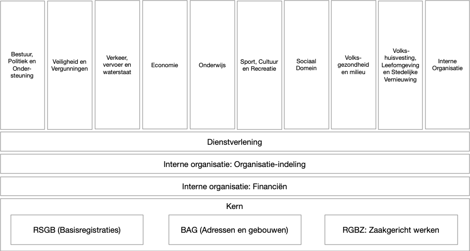

# Beheerplan Gemeentelijk Gegevensmodel

**Versieoverzicht**

| Versie | Status     | Datum       | Auteur(s)           | Toelichting                        |
|--------|------------|-------------|---------------------|------------------------------------|
| 0.1    | Concept    | 30/11/2022  | Arjen Brienen       | Initiële versie                    |
| 1.0    | Definitief | 05/04/2023  | Marianne v.d. Stoel | Opmerkingen expertgroep verwerkt   |

**Review**

| Naam                                | Organisatie             |
|-------------------------------------|-------------------------|
| Frans van der Waal                  | Gemeente Utrecht        |
| Natalie Pollock                     | Gemeente Meierijstad    |
| Arjen Verhulst                      | Gemeente Nijmegen       |
| Tom Ulema                           | Gemeente Amersfoort     |
| Toine Schijvenaars                  | VNG                     |

**Colofon**

| Organisatie     | Datum      | Auteur          |
|-----------------|------------|-----------------|
| Gemeente Delft  | Maart 2023 | Arjen Brienen   |

## Algemeen

Dit document is een plan op basis waarvan het beheer van het Gemeentelijk Gegevensmodel (GGM) wordt uitgevoerd. Dit plan geeft inzicht in de inhoud en omvang van de relevante beheerprocessen, welke middelen gebruikt worden en welke afspraken gehanteerd worden.

## Inleiding
### BOMOS

BOMOS is hét Beheer- en Ontwikkelmodel voor Open Standaarden binnen de Nederlandse overheid. BOMOS kan op verschillende manieren gebruikt worden:

- voor het opzetten van beheer van standaarden of stelsels
- als hulpmiddel voor verdere ontwikkeling van beheerorganisaties
- als richtlijn om aan te voldoen
- als onderbouwing voor het aanvragen van de status ‘Uitstekend Beheer’ van uw standaard bij Forum Standaardisatie
- als inspirerend naslagwerk 

De Gemeente Delft richt het beheer van het GGM in conform BOMOS (het Beheer en OntwikkelModel voor Open standaarden). Dit Beheerplan GGM is afgeleid van het generieke BOMOS-beheerplan dat is gepubliceerd door Geonovum.

BOMOS onderscheidt verschillende levenscyclusfases waarin een standaard zich kan bevinden, namelijk:
1. Creatie/ontwikkeling
2. Introductie
3. Implementatie/groei
4. Volwaardige toepassing
5. Uitfaseren

Het GGM bevindt zich in de fase van implementatie en groei van de standaard. BOMOS zegt daar het volgende over:

*"In deze fase kiezen gebruikers bewust voor de implementatie van de standaard. In het beheer wordt ook rekening gehouden met het feit dat niet alle gebruikers beschikken over een volwaardig kennisniveau van de standaard. Beheer betekent in deze fase ook de ondersteuning en het informeren van de gebruikers. Marketingtermen als ‘early majority’ zijn in deze fase van toepassing. Uw activiteiten zijn gericht op meer professionele adoptie en professionalisatie van de open beheerprocessen, zodat bij opschaling van het gebruik alle partijen aangehaakt blijven en de processen transparant verlopen. Registraties van gebruikers/ afnemers/ experts etc. worden steeds belangrijker."*

## Strategie

### Visie

Het Gemeentelijk Gegevensmodel (GGM) is een logisch gegevensmodel met daarin vertegenwoordigd alle beleidsterreinen van de gemeente. Het GGM is ontwikkeld in opdracht van de Gemeente Delft ter ondersteuning van de visie op het gebied van informatiegestuurd werken. Onder andere wordt het GGM gebruikt als centraal datamodel in het datawarehouse. Hiertoe is een generator beschikbaar om het GGM te vertalen naar fysieke databasetabellen.

Het GGM omvat alle beleidsterreinen die onder de verantwoordelijkheid van de gemeente vallen. Dit ongeacht de organisatorische inrichting, zoals de afdelingen die de bijbehorende taken uitvoeren en uitbesteding aan derde partijen. Deze beleidsterreinen zijn afgeleid van de IV3-taakvelden.

### Governance

Het GGM is ontwikkeld door de Gemeente Delft in het kader van delftse strategie voor informatiegestuurd werken. Het GGM is echter breed toepasbaar, aangezien het een informatiemodel is dat van toepassing is op alle gemeenten. Om deze reden heeft de
Gemeente Delft het GGM onder opensource licentie gepubliceerd op GitHub. Voor het verdere beheer en de ontwikkeling wordt de samenwerking gezocht met andere gemeenten en overheidspartijen door Delft. Doel is het GGM verder te brengen met andere
gemeenten en andere overheidspartijen.

**Beheerbureau:** Het beheerbureau is verantwoordelijk voor de operationele activiteiten rond beheer en ontwikkeling van het GGM. Het gaat hier om de volgende activiteiten:

1. Organiseren bijeenkomsten van expertgroep en gebruikersgroep
2. Administratief verwerken van binnenkomende meldingen en issues op de Pleiopagina
van het GGM, en deze rapporteren aan de expertgroep.
3. Publiceren notulen en besluiten van expertgroep en gebruikersgroep op de Pleiopagina
van het GGM.
4. Administreren leden van expertgroep en gebruikersgroep in Pleio.
Doelstelling is de uitvoering van het beheerbureau jaarlijks wisselend bij een van de in de
expertgroep vertegenwoordigde organisaties te beleggen. In 2023 zal de Gemeente Delft als
eerste het beheerbureau bemannen.

**Expertgroep:** De Expertcommissie verbetert en actualiseert het GGM. Zij doet dit door in onderling overleg en met als input de meldingenlijst en eigen punten van verbetering. Doelstelling is expertise bij elkaar te brengen om de standaard te verbeteren, te documenteren en het vertalen van gebruikerswensen naar de standaard. Vertegenwoordigers van stakeholders kunnen zich bij het beheerbureau melden om deel te nemen aan de expertgroep. Deze deelname is niet vrijblijvend.

De expertgroep komt minimaal tweemaandelijks bij elkaar en kent de volgende taken:

1. Prioriteren meldingen en verbeteringen
2. Maken voor voorstellen ten aanzien van verbetering van het GGM
3. Doorvoeren verbeteringen door werk te verdelen tussen de aangesloten partijen
4. Publiceren van verbeteringen op GitHub
5. Bijwerken handleiding op GitHub

Deelnemende organisaties verdelen in principe in onderling overleg het uit te voeren werk, ook kunnen zij via subsidies of andere geldstromen werkzaamheden laten uitvoeren door een derde partij.

**Gebruikersgroep:** De gebruikersgroep wisselt kennis en kunde uit over de toepassing van het GGM. Dit doen zij door eenmaal per jaar samen te komen, door een aantal maal per jaar (al naar gelang de behoefte) een online of hybride workshop / mini-conferentie te kunnen volgen en door producten en best practices uit te wisselen via de Pleio-pagina. Vertegenwoordigers van
gebruikers van het GGM kunnen zich via de Pleio pagina van het GGM via [deze link](https://kennisnetwerkdata.pleio.nl/groups/view/1e7df5c5-e537-46cd-9d09-de2ef29beef8/gemeentelijk-gegevensmodel-ggm) aanmelden als lid van de gebruikersgroep. Deze deelname is vrijblijvend.

### Financiën

De Gemeente Delft garandeert het beheer van het GGM voor wat betreft het beheerbureau en de eigen ontwikkeling voor een periode van drie jaar. Aan de expertgroep deelnemende partijen financieren hun eigen ontwikkeling door de ter beschikkingstelling van menskracht of financiën om deze ontwikkelingen door te voeren. Alle verbeteringen worden onder opensource licentie gepubliceerd.

Voor grotere ontwikkelingen kan door de expertgroep subsidie aangevraagd worden, of kunnen derde partijen financiën ter beschikking stellen.

## Tactiek
### Community

De community van het GGM is vertegenwoordigd in de gebruikersgroep, en uitvoerend in de expertgroep. Beide groepen staan open voor aanmelding van alle stakeholders vanuit de overheid.

### Adoptie en erkenning

Adoptie van het GGM door steeds meer gemeenten en andere overheden die informatie uit wisselen met gemeenten wordt als van groot belang gezien. Er worden op dit moment de volgende wegen bewandeld om tot een bredere adoptie en erkenning te komen:

1. Het GGM wordt aangeboden voor de Lijst Open standaarden van het Forum Standaardisatie. Opname op de lijst zal verdere adoptie vergroten;
2. Het GGM wordt onder de aandacht gebracht van diverse landelijke programma’s die gemeentelijke gegevens raken;
3. Diverse vormen van presentatie worden gehanteerd, waaronder: de GGMconferentie, publicatie op social media en publicatie in vaktijdschiften.

### Rechtenbeleid

Het GGM is gepubliceerd onder de licentie [GNU General Public License v3.0](https://github.com/gemeente-delft/gemeentelijk-Gegevensmodel/blob/master/LICENSE). 

### Architectuur
Het GGM kent een gelaagde opbouw, waarbij verschillende objecttypen over beleidsdomeinen heen zoveel mogelijk zijn ontkoppeld. Alleen objecttypen in de onderste lagen van het model worden gebruikt door de bovenliggende onderdelen.

Het gegevensmodel is uitgewerkt in een aantal verticale beleidsdomeinen en 4 horizontale beleidsdomeinen. De horizontale delen (Kern, Financiën, ICT en Dienstverlening) vormen de basis van het gegevensmodel, waarop de verticale delen voortbouwen. De Kern bestaat uit RSGB en RGBZ, die de gegevensdefinities bevatten die zoals die gelden voor de basisregistraties (RSGB) en zaakgericht werken (RGBZ). 

Er is ontkoppeling tussen de verschillende (sub)domeinen nagestreefd, doordat in de gegevensdefinities van het gegevensmodel (sub)domeinen alleen definities uit onderliggende (sub)domeinen gebruiken. Zo gebruiken alle (sub)domeinen gegevensdefinities uit Kern en kunnen alle verticale (sub)domeinen gegevensdefinities gebruiken uit de 4 horizontale modellen.

### Kwaliteitsbeleid en benchmarking

De inhoudelijke kwaliteit van het GGM wordt getoetst door toepassing van referentieimplementaties bij gemeenten die de kwaliteit en de toepasbaarheid in de praktijk van de nieuwe versie aantonen. Daarnaast beoordeelt de expertgroep per gemeentelijk domein of
de juist objecttypen, attributen en domeinwaarden zijn gekozen.

## Operationeel
### Initiatie

Ideeën en wensen over toepassing, gebruik en functionaliteit van het GGM komen binnen via de Pleio pagina van het GGM en via de expertgroep. Kleine wijzigingen die nog backwards compatible zijn met de actuele het GGM-versie kunnen worden opgelost door een van de expertgroepleden. Indien de wijziging een grote impact op de standaard heeft valt wordt deze ter prioritering aangeboden aan de Expertgroep.

### Wensen en eisen

Wensen en eisen komen binnen via de Pleio pagina van het GGM en de expertgroep. Binnen het opgestelde plan voor versiebeheer wordt door de expertgroep een beheeragenda opgesteld. Binnen gekomen wijzigingsvoorstellen worden gecategoriseerd in:

- correctief
- preventief
- adaptief
- additief

De wijzigingsverzoeken worden door de expertgroep opgepakt. De impact van de wijziging op de standaard wordt bepaald. Het versiebeheerprotocol en beheeragenda bepalen wanneer een wijzigingsvoorstel wordt geïmplementeerd.

### Uitvoering

De meldingenlijst, wensen van de expertgroepleden en nieuwe versies van gerelateerde standaarden geven aanleiding tot de verdere ontwikkeling van het GGM. Hiertoe worden nieuwe versies gemaakt van het GGM, of de deelmodellen behorende bij individuele
beleidsdomeinen. Minimaal tweemaal per jaar wordt een nieuwe release van het GGM gepubliceerd.

Het wijzigingsprotocol geeft richting aan het proces dat dit wijzigingsvoorstel doorloopt. De expertgroep beoordeelt en geeft bij instemming met het voorstel haar goedkeuring aan deze wijzigingsvoorstellen. Het gaat hier om wijzigingsvoorstellen die een grote impact hebben op het GGM. In het geval van een kleine aanpassing worden de expertgroep en de community alleen geïnformeerd. Zij hoeft niet te beslissen, omdat deze wijzigingen klein zijn en minimale impact hebben.
Nieuwe versies kunnen betrekking hebben op het gehele GGM, of op een van de beleidsdomeinen (zie Architectuur)

In onderstaande tabel zijn vervolgstappen in de wijzigingsprocedure van de standaard uitgewerkt en toegelicht. Deze stappen leiden telkens tot een statusverandering van het document dat de standaard beschrijft.

**Status standaard Beschrijving activiteiten**

| **Status**     | **Beschrijving activiteiten** |
|----------------|-------------------------------|
| **PROPOSAL**   | Eerste interne versie van het wijzigingsvoorstel binnen de expertgroep. Oplossingen en uitwerkingen van ingediende meldingen worden hierin opgenomen en besproken. Dit kan leiden tot nieuwe versies van het PROPOSAL. |
| **DRAFT**      | Verdere uitwerking van het PROPOSAL. Wordt besproken en gereviewd door een beperkte groep belanghebbenden (besloten consultatie). Commentaar wordt verwerkt tot alle opmerkingen en discussiepunten zijn afgehandeld. Bij sterk vernieuwde inzichten kan een nieuw PROPOSAL worden opgesteld. Na goedkeuring door de expertgroep gaat de DRAFT naar openbare consultatie via de Pleio-pagina van het GGM. Feedback uit de publieke consultatie wordt verwerkt. |
| **FINAL DRAFT**| Na de openbare consultatie stelt de expertgroep de FINAL DRAFT op. De expertgroep beoordeelt en geeft bij instemming goedkeuring aan de wijzigingsvoorstellen. |
| **RELEASE**    | Versie waarmee de expertgroep instemt: de actuele versie die wordt onderhouden en waarop ondersteuning wordt geboden. Alle onderdelen zijn raadpleegbaar en te downloaden. Reacties op de inhoud kunnen door iedereen worden gegeven via Pleio of GitHub. |
| **DEPRECATED** | Wanneer een nieuwe versie van het GGM uitkomt, krijgt de voorgaande versie de status *deprecated* (afgeraden). Onderhoud vindt niet meer plaats, maar ondersteuning blijft beschikbaar gedurende een vastgestelde implementatietermijn. Na afloop vervalt de versie (DECLINE). |
| **DECLINE**    | Onderhoud op de vorige versie vindt niet meer plaats nadat de nieuwe versie is vastgesteld. Ondersteuning blijft beschikbaar voor de termijn die de expertgroep vaststelt. Na afloop vervalt de versie definitief. |

### Documentatie

Tot de documentatie behoren het GGM zelf, maar bijvoorbeeld ook publicaties, verslagen en presentaties over het GGM. De documentatie over het GGM wordt gepubliceerd op GitHub met de aan GitHub gekoppelde handleiding. Deze documentatie bestaat uit de volgende elementen:

1. Het GGM in de volgende formaten:
    - Enterprise Architect (EAPX)
    - XMI
    - Eventuele formaten van derde partijen
2. De handleiding op https://gemeente-delft.github.io/Gemeentelijk-Gegevensmodel/
3. Codegeneratietemplates, zie https://gemeente-delft.github.io/Gemeentelijk-Gegevensmodel/generatie/

De overige documentatie vindt plaats op de Pleio pagina van het GGM, dit bestaat onder andere uit:

4. Publicaties
5. Proposals
6. Presentaties
7. Agenda’s en Notulen
8. Releasenotes
9. Informatie over de expertgroep en de gebruikersgroep.

Hier kunnen gebruikers ook hun vragen en opmerkingen posten of discussies starten.

### Technische hulpmiddelen

Het GGM is een informatiemodel dat onafhankelijk is van modelleersoftware. Het GGM is gemodelleerd in UML. Voor wat betreft uitbreiden van het GGM is er gekozen voor modelleersoftware Enterprise Architect van Sparx. Voor de generatie van fysieke
databasemodellen wordt gebruik gemaakt van de generatiemogelijkheden van Enterprise Architect van Sparx. Er zijn formaten voor andere modelleersoftware beschikbaar, deze worden zoveel mogelijk gepubliceerd maar nog niet actief ondersteund. Doel is tot een bredere ondersteuning van modelleersoftware te komen, met een voorkeur voor opensource producten.

Voor de overige technische hulpmiddelen is er voorkeur voor opensource producten. Bij het
GGM wordt gebruik gemaakt van:

- GitHub voor opslag, versiebeheer en publicatie GGM
- GitHub voor handleiding i.c.m. Mkdocs voor generatie handleiding
- Pleio voor meldingen-platform
- Pleio voor informatie van en over expertgroep en gebruikersgroep, zoals notulen, agenda met vergaderdata, beheeragenda

### Validatie

Een gebruiker kan de conformiteit van de implementatie van het GGM laten toetsen door expertbeoordeling, dit is echter nog niet formeel en structureel ingericht.

### Personeel

Het GGM is kennisintensieve standaard, waardoor het kennisniveau, ervaring, netwerk en samenwerkingssensitiviteit van belang zijn. Met name voor de expertgroep is het kennisniveau van de rol gegevensarchitect (of vergelijkbaar) noodzakelijk.

## Implementatieondersteuning
### Opleiding en advies

Leden van de expertgroep geven een aantal maal per jaar (al naar gelang de behoefte) een uitleg in een online of hybride workshop/miniconferantie over het GGM. Binnen de gebruikersgroep kunnen via de Pleio pagina van het GGM vragen die betrekking hebben op de toepassing van het GGM worden gesteld.

### Helpdesk

Vragen over het GGM kunnen worden ingediend via de Pleio pagina van het GGM.

### Pilot

Pilots worden door individuele gemeenten die het GGM toepassen uitgevoerd.

### Validatie en certificatie

Voor het GGM is er in deze fase geen officiële validator of certificatie-autoriteit. Het GGM voldoet aan de toegepaste landelijke standaarden, en kan worden gesteund op de daarbij behorende compliancyvoorzieningen.

## Communicatie
### Promotie
Informatie over het GGM wordt verstrekt via de GitHub, de GitHub-handleiding en de Pleiopagina’s Daarnaast worden er meetups en conferenties georganiseerd, en vindt promotie plaats via social media.

### Publicatie

Publicatie, informatie over het GGM en het GGM beheer wordt op de volgende manier gepubliceerd:

- GitHub: download van GGM en bijbehorende tooling, inclusief verschillende versies.
- GitHub-handleiding: technisch inhoudelijke handleiding
- Pleio-pagina: informatie over en door de expertgroep en de gebruikersgroep

### Klachtenafhandeling
 
Klachten met betrekking tot de standaarden zijn van de volgende aard:

- over de toepassingsmogelijkheid van de standaard;
- over het beheer van de standaard.

In het eerste geval behandelt het Beheerbureau de klacht en legt deze waar nodig voor aan de expertgroep of gebruikersgroep. Uitleg geven over het gebruik van de standaard is een van de taken van het beheer van de standaard. De klacht kan mogelijk leiden tot een wens tot aanpassing van de standaard. Dit wordt dan als melding geregistreerd. In het tweede geval is er sprake van ontevredenheid over de uitvoering van het beheer van de standaard. Dit treft de organisatie die het beheer uitvoert. De klager kan zijn/haar klacht op papier indienen bij de expertgroep. De expertgroep neemt de klacht in behandeling.