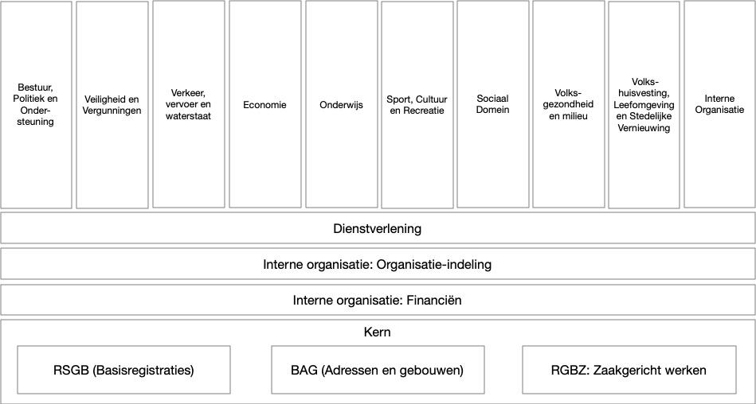
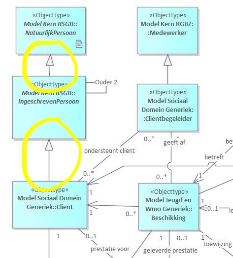

# Toegepaste patronen

In dit hoofdstuk introduceren we de belangrijkste patronen die binnen het GGM worden toegepast. Deze patronen vormen de basis voor de manier waarop we het model uitbreiden, beheren en toepassen in verschillende domeinen. Door patronen centraal te stellen, zorgen we ervoor dat het GGM niet alleen flexibel en uitbreidbaar is, maar ook consistent en beheersbaar blijft.

Het toepassen van patronen binnen het GGM is belangrijk omdat het:

- richting en houvast geeft bij het ontwerpen en uitbreiden van het model;
- bijdraagt aan de kwaliteit en uniformiteit van de modelelementen;
- hergebruik van bestaande onderdelen stimuleert en duplicatie voorkomt;
- de beheersbaarheid van het model vergroot door duidelijke ontwerpregels;
- helpt om complexiteit te reduceren en begrijpelijkheid te behouden.

Twee patronen staan aan de kern van de opbouw van het GGM en worden daarom hier beschreven.

## Stacked Dependency Approach

Bij het ontwikkelen van multi-domein informatiemodellen zoals het GGM ontstaat vaak de uitdaging om domeinspecifieke modellen met elkaar te verbinden zonder dat er een te sterke onderlinge koppeling ontstaat. Het GGM hanteert hiervoor de **Stacked Dependency Approach**.

In dit patroon zijn de modellen gelaagd opgebouwd: de onderste lagen bevatten de fundamentele objecttypen en datatypen die door alle hogere lagen kunnen worden hergebruikt. Hogere lagen – de deeldomeinen – bouwen uitsluitend voort op de onderliggende lagen. Belangrijk is dat er **geen horizontale afhankelijkheden** ontstaan tussen modellen op hetzelfde niveau. 

Deze aanpak biedt verschillende voordelen:
- vermindering van complexiteit door een duidelijke verticale structuur;
- voorkomen van cirkelverwijzingen;
- betere onderhoudbaarheid doordat domeinen zich onafhankelijk kunnen doorontwikkelen;
- behoud van noodzakelijke integratiepunten via de gemeenschappelijke basislagen.

De toepassing van de Stacked Dependency Approach vereist wel zorgvuldig ontwerp van de basislagen en goed beheer om ongewenste koppelingen te voorkomen. Binnen het GGM heeft deze aanpak zich bewezen als een effectief middel om losse domeinen te verbinden en tegelijkertijd de samenhang en uitbreidbaarheid van het geheel te waarborgen.

In onderstaande afbeelding zie je hoe dit patroon binnen het GGM is toegepast. De deelmodellen bouwen voort op onderliggende deelmodellen, en gebruiken modelelementen uit deze onderliggende lagen. De basis wordt gevormd door de RSGB, BAG en het RGBZ.

!!! rule "Ontwerpregel p1: Hergebruik alleen modelelementen uit onderliggende modellen"
    - Leg nooit relaties naar deelmodellen op hetzelfde niveau, zoals vanuit Economie naar onderwijs
    - Gebruik hiervoor onderliggende modellen, of introduceer een generieke model als basis voor meerdere modellen  

## Overerving

Overerving is een krachtig patroon binnen informatiemodellering waarbij een generiek, algemeen model dient als basis voor meer specifieke deelmodellen. Door eigenschappen en relaties te erven van een bovenliggend model, kunnen domeinen consistente en herbruikbare structuren ontwikkelen zonder duplicatie van informatie. Dit bevordert de uniformiteit en maakt het eenvoudiger om uitbreidingen door te voeren.

In het GGM wordt overerving toegepast om gemeenschappelijke kenmerken van objecttypen centraal vast te leggen, waarna specifieke domeinen deze uitbreiden met eigen details. Dit voorkomt inconsistenties en zorgt voor een heldere hiërarchie binnen het model. Overerving kan zowel op het niveau van klassen als attributen plaatsvinden, wat flexibiliteit biedt bij het modelleren van complexe domeinen.

De voordelen van de toepassing van overerving zijn onder andere:
- bevordering van hergebruik en consistentie van modelelementen;
- vereenvoudiging van onderhoud door centrale aanpassing van gedeelde eigenschappen;
- duidelijke hiërarchische structuur die complexiteit reduceert;
- ondersteuning van polymorfisme waardoor modellen flexibel blijven bij uitbreidingen.

Wel moet worden opgelet voor valkuilen zoals te diepe of brede erfstructuren, die de begrijpelijkheid kunnen verminderen. Ook kan overmatig gebruik van overerving leiden tot strakke koppelingen die toekomstige veranderingen bemoeilijken. Daarom is een gebalanceerde toepassing met duidelijke ontwerpregels essentieel.

Een voorbeeld binnen het GGM is het gebruik van een generiek "Persoon" model dat wordt uitgebreid in domeinen zoals "Medewerker" en "Klant", waarbij elk domein specifieke attributen en relaties toevoegt zonder de basisstructuur te wijzigen.

In bovenstaand voorbeeld is te zien hoe in het deelmodel Sociaal doemin generiek en in het model Jeugd en Wmo generiek via overerving gebruik gemaakt wordt van IngeschrevenPersoon die op zijn beurt weer een NatuurlijkPersoon is.  

!!! rule "Ontwerpregel p2: Gebruik overerving om gemeenschappelijke eigenschappen te centraliseren"
    - Vermijd het creëren van te diepe of te brede erfhiërarchieën
    - Beperk overerving tot conceptueel verwante modellen om begrijpelijkheid te waarborgen
    - Pas overerving toe om hergebruik te stimuleren, maar voorkom te strakke koppelingen die flexibiliteit beperken
    - Documenteer duidelijk welke eigenschappen in het bovenliggende model zijn vastgelegd en welke in de submodellen worden toegevoegd

### Veel gebruikte overerving

Deelmodellen van het GGM maken veelal gebruik van de onderliggende modellen door overerving. In principe kunnen alle objecttype uit deze onderliggende modellen worden hergebruikt, toch is er een aantal dat veelvuldig wordt gebruikt het gaat om de volgende:

- [IngeschrevenPersoon](../../definities/definitie_Model%20Kern%20RSGB#ingeschrevenpersoon) (RSGB): een persoon die is ingeschreven in het bevolkingsregister, en dus dienstverlening van de gemeente kan ontvangen
- [NatuurlijkPersoon](../../definities/definitie_Model%20Kern%20RSGB#natuurlijkpersoon) (RSGB): een persoon die leeft of geleefd heeft. Hoeft niet ingeschreven te zijn. Kan een historisch figuur zijn, een ingeschreven persoon (overerving) of iemand die niet in Nederland is ingeschreven
- [NietNatuurlijkPersoon](../../definities/definitie_Model%20Kern%20RSGB#nietnatuurlijkpersoon) (RSGB): een bedrijf of een instelling. Wordt vaak gebruikt als partij waarmee contracten afgesloten kunnen worden
- [Rechtspersoon](../../definities/definitie_Model%20Kern%20RSGB#rechtspersoon) (RSGB): een natuurlijk of niet natuurlijk persoon. De hoogste qua overerving van de verschillende soorten personen. Veralgemenisering voor natuurlijke en niet natuurlijke personen
- [Medewerker](../../definities/definitie_Model%20Kern%20RGBZ#medewerker) (RGBZ): een medewerker van de gemeente
- [AanvraagOfMelding](../../definities/definitie_Model%20Dienstverlening#aanvraagofmelding) (Dienstverlening): veralgemenisering van alle soorten aanvragen en meldingen die bij de gemeente kunnen binnenkomen. Zijn vele subclasses met eigen attributen van gemaakt, zoals een MeldingOpenbareRuimte.
- [Client](../../definities/definitie_Model%20Sociaal%20Domein%20Generiek#client) (Sociaal Domein Generiek): centrale entiteit die diensten in het kader van het sociaal domein krijgt van de gemeente. Is afgeleide in IngeschrevenPersoon en wordt gebruikt in alle domeinen van het sociaal domein
- [Huishouden](../../definities/definitie_Model%20Sociaal%20Domein%20Generiek#huishouden) (Sociaal Domein Generiek): entiteit die wordt gebruikt voor het weergeven van een huishouden van meerdere personen op één adres