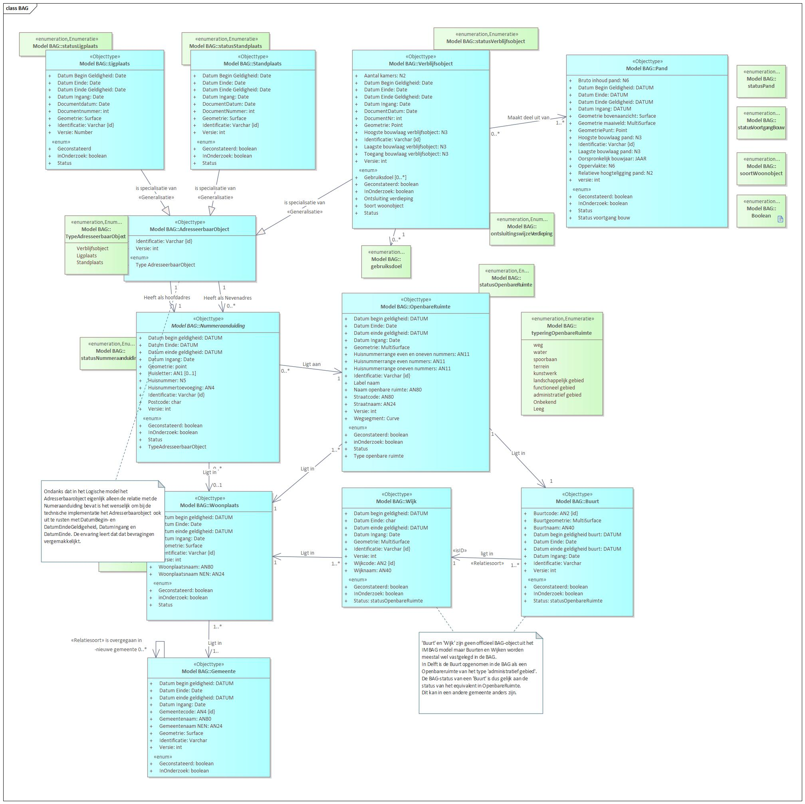

# BAG

The Base Registrations of Addresses and Buildings (BAG) contain data on all addresses and buildings in the Netherlands.

The main goal of the BAG is to uniquely identify and designate addressable objects and buildings. This creates a clear relationship between addressing and the object the address relates to, and lays the basis for more unambiguous relationships between different registrations.

The next figure shows the BAG model:

<em>Diagram (in Dutch): the BAG (Addresses and Buildings) information model.</em>

For more information about the BAG information model, see the [BAG Catalogue](https://www.geobasisregistraties.nl/documenten/publicatie/2018/03/12/catalogus-2018) and [Stelselpedia](https://www.amsterdam.nl/stelselpedia/bag-index/catalogus-bag/) (both in Dutch).
