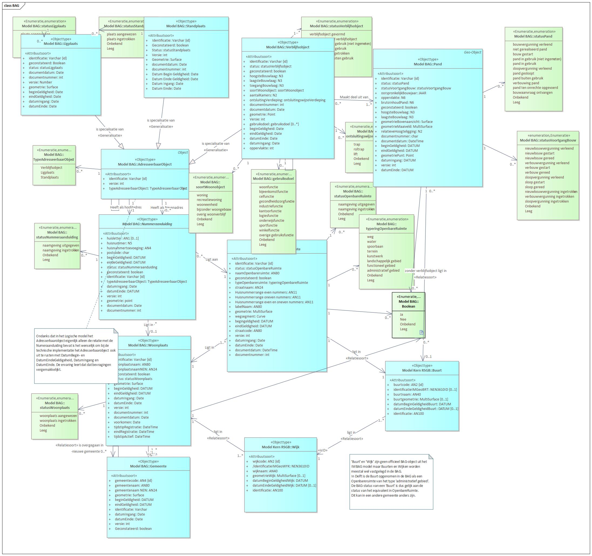

# BAG
De Basisregistraties Adressen en Gebouwen (BAG) bevatten gegevens van alle adressen en gebouwen in Nederland.

Het belangrijkste doel van de BAG is het uniek identificeren en aanduiden van adresseerbare objecten en panden. Op deze wijze ontstaat een duidelijke relatie tussen de
adressering en het object waarop het adres betrekking heeft en wordt een aanzet gegeven tot het leggen van meer eenduidige relaties tussen verschillende registraties.

In de volgende figuur is het model van de BAG weergegeven:

Voor meer informatie over het informatiemodel BAG kunt u terecht bij de [Catalogus BAG](https://www.geobasisregistraties.nl/documenten/publicatie/2018/03/12/catalogus-2018) en
[Stelselpedia](https://www.amsterdam.nl/stelselpedia/bag-index/catalogus-bag/).
