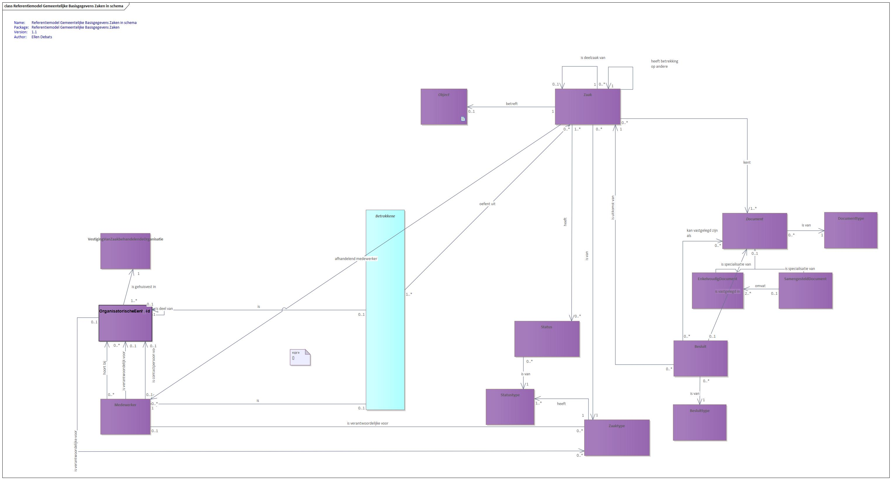

# RGBZ

The Reference Model for Municipal Basic Case Data (RGBZ, Dutch: *Referentiemodel Gemeentelijke Basisgegevens Zaken*) specifies the data and its coherence that municipalities, their collaborating organisations and their customers minimally need to be sufficiently informed about ongoing and completed cases. The information model is aimed at:

- Adequately informing those involved in and interested in a case. This ranges from external and internal initiators of a case, via co-handlers, to those interested in the publication of the case or its result, to management in need of steering information.
- Being able (also after the fact) to account for the case, both substantively (has the case been handled properly) and procedurally (has the case been handled in the right way).
- Reconstructing the case — or its handling — if needed.

The information model contributes to:

- improving services to citizens,
- supporting electronic service delivery,
- improving the municipality's operations,
- more adequately managing the increasingly digital documentary information and archiving.

The diagram below shows the RGBZ model. Note that cases always relate to one or more objects from other domains. For clarity those objects are not included in the diagram.

<em>Diagram (in Dutch): the RGBZ (case-oriented working) information model.</em>

For more information about the RGBZ model, see these [GEMMA pages](https://vng-realisatie.github.io/RGBZ/) (in Dutch).
