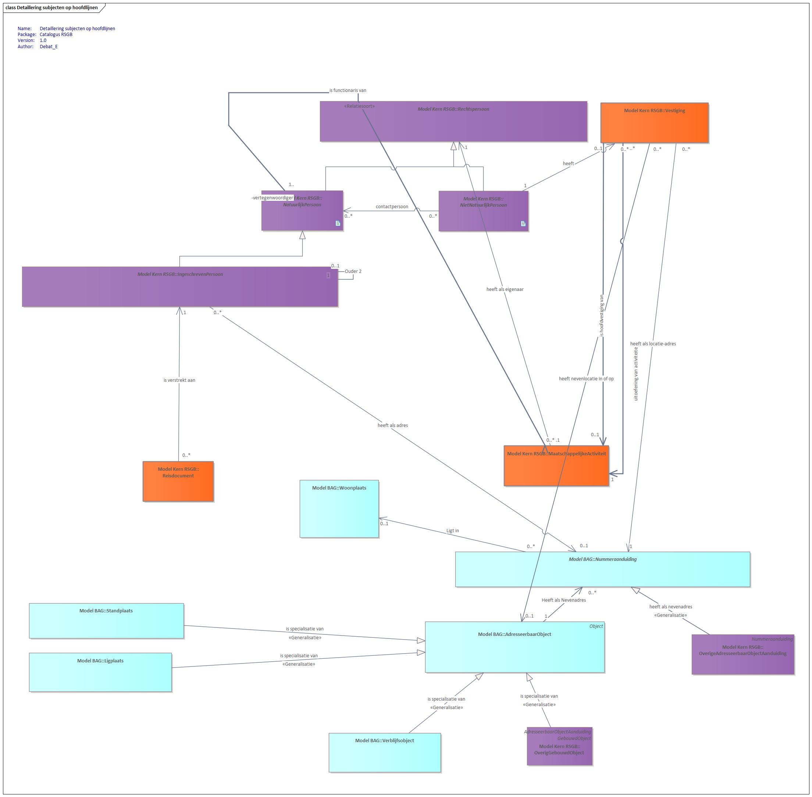

# RSGB

The *Reference Model for the System of Municipal Basic Data* (RSGB, Dutch: *Referentiemodel Stelsel van Gemeentelijke Basisgegevens*) is a municipal standard that helps structure and exchange basic data within government.

The RSGB provides a standardised model for recording and exchanging essential information such as addresses, buildings, roads and other municipal data. The goal of the municipal RSGB is to promote consistency, interoperability and efficiency within municipal information provision, so data can easily be exchanged between municipal systems and organisations.

The RSGB is based on the Base Registrations of Addresses (BRA), Buildings (BRG), Persons (GBA), Businesses (NHR), Cadastre (BRK) and Real-estate Valuation (BRWOZ), and on the large-scale topography defined in the Geographic Information Model (IMGeo). Additional data from the 1998 predecessor of the reference model — GFO BasisGegevens — has been added, keeping the model deliberately constrained.

The reference model is built from:

- object types such as *Verblijfsobject* (Residence Object) and *Ingeschreven persoon* (Registered Person);
- attribute kinds describing their properties, such as *Bruto inhoud* (Gross volume) and *Voornamen* (Given names);
- relationship kinds between these object types, such as *Registered person resides in Residence Object*.

Because of this setup, the RSGB is not tied to a single domain — elements from the RSGB appear in various domains. The model can therefore also be used to visualise relationships between domains.

The diagram below shows the RSGB at a high level:

<em>Diagram (in Dutch): high-level overview of the RSGB (Reference Model for the System of Municipal Basic Data).</em>

For more information about the RSGB, see these [GEMMA pages](https://vng-realisatie.github.io/RSGB/) (in Dutch).
