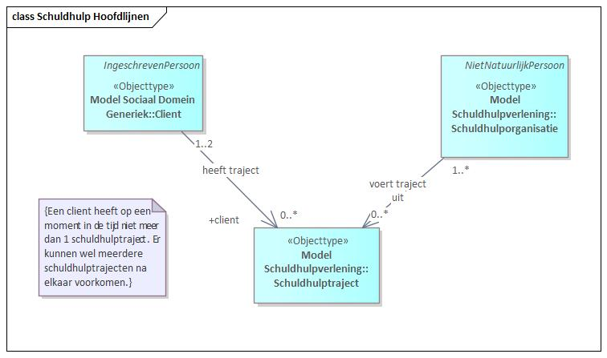
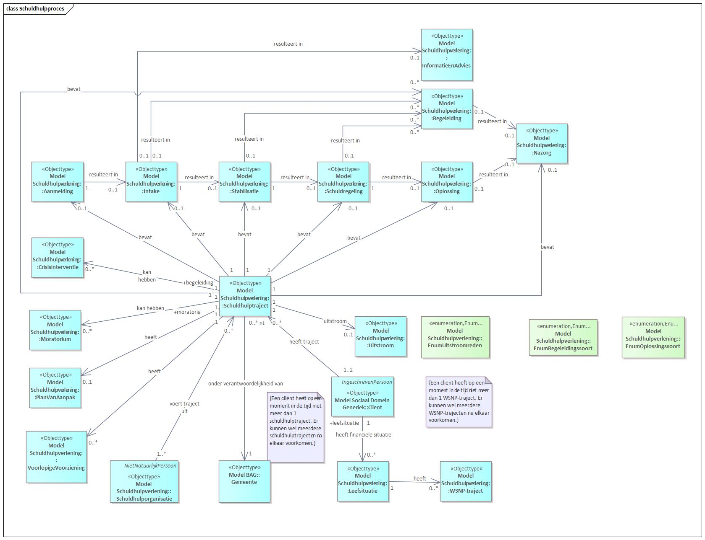
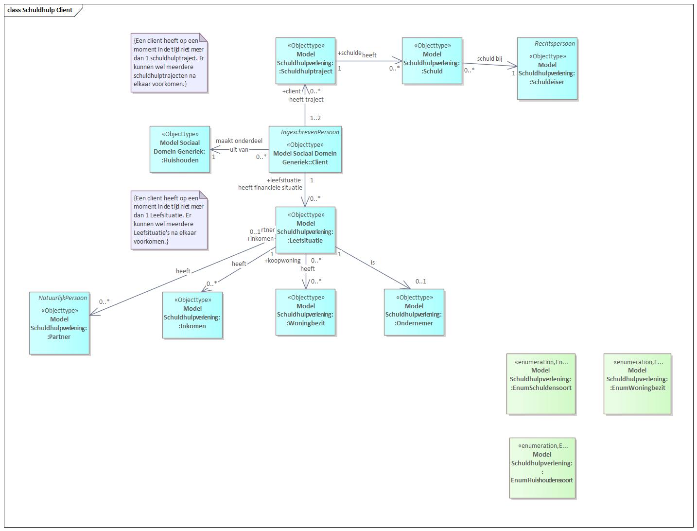
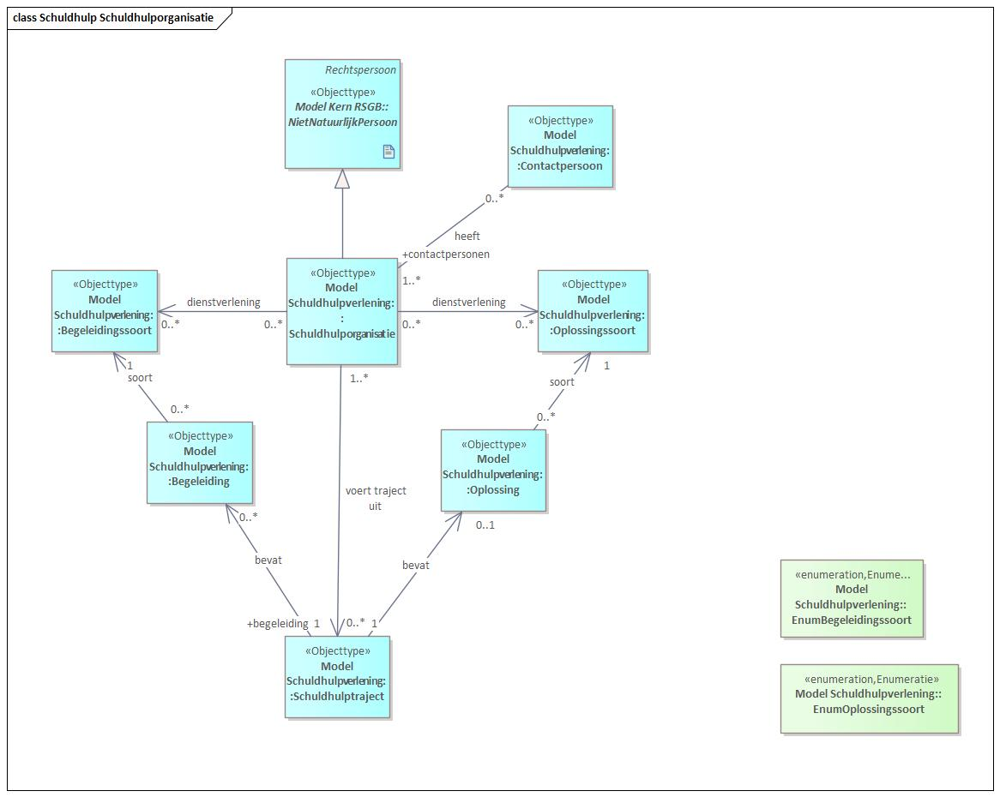

# Debt Counselling

## Background: DDAS (Data Sharing for Poverty and Debts)

[VNG](https://vng.nl), [Divosa](https://www.divosa.nl) and [NVVK](https://www.nvvk.nl) have joined forces and, in collaboration with [CBS](https://www.cbs.nl) (Statistics Netherlands), launched an initiative to improve data sharing in the poverty-and-debt domain and encourage data-driven municipal policy and execution. This initiative — [DDAS](https://www.divosa.nl/projecten/data-delen-over-armoede-en-schulden) (*Datadelen op Armoede en Schulden*) — started in 2022 with a subsidy from the [Ministry of Social Affairs and Employment](https://www.rijksoverheid.nl/ministeries/ministerie-van-sociale-zaken-en-werkgelegenheid).

At the heart of DDAS is standardising the data requested by the umbrella organisations (aligning definitions), optimising (requesting only what is needed) and making it flexible (usable for multiple purposes). Through standardisation and optimisation, administrative burden for municipalities and other parties is reduced while information quality rises.

A key part of DDAS is enabling data sharing between municipalities and CBS so that, over time, a reliable national picture can be sketched of debt and poverty issues and their development. Data on debt counselling is provided from the counselling bodies to CBS, which produces statistics for that national picture.

An information model has been drawn up and incorporated into the GGM; it is described below. More information about DDAS: [DDAS information page](https://vng-realisatie.github.io/ddas/) (in Dutch).

## Debt Counselling information model

At the heart of the Debt Counselling information model is a *Debt-counselling Trajectory* carried out for one or two clients. If clients are married and liable for each other's debts, they are part of the same trajectory. It can also be a (now-separated) partner with whom debts were jointly incurred in the past. A client can have only one *Debt-counselling Trajectory* at a time, but may have gone through several sequentially.

One or more *Debt-counselling Organisations* deliver the trajectory to the client(s). Often, besides the municipality, other parties are involved in parts of the trajectory.

<em>Figure 2 (in Dutch): main structure of Debt Counselling — Trajectory, Client and Organisation.</em>

A *Client* is always a *Registered Person* as known in the BRP (Base Registration of Persons), and has the characteristics recorded there. Not all these data need be available at every point in the process, though. A *Debt-counselling Organisation* is a *Non-Natural Person* (business, institution or government organisation) and has those characteristics.

## Processes

The process part of the information model is based on the NVVK Reference Process and elaborates the processes that may occur within a trajectory.

<em>Figure 3 (in Dutch): the phases of a Debt-counselling Trajectory.</em>

A trajectory may contain the phases: *Registration*, *Intake*, *Stabilisation*, *Debt arrangement*, *Resolution* and *Aftercare*. It may also contain multiple kinds of guidance. The listed phases imply the order shown in Figure 3. A trajectory can have only one *Resolution*, but several resolutions are possible (listed in *EnumResolutionKind*). The possible kinds of guidance are specified in *EnumGuidanceKind*.

A trajectory may also have a *Plan of Approach* and an *Exit Reason*. If there is an *Exit Reason*, the trajectory has ended. A list of possible exit reasons is in *EnumExitReason*. Within a trajectory, multiple *Crisis Interventions* may occur, and it may include multiple *Moratoria*.

## Clients

Within the Debt Counselling Information Model, the following object types are recorded around the *Client* in the context of a trajectory. Not all attributes from the BRP are taken over — only those necessary to identify the client: BSN and — if unavailable — date of birth, gender, postcode, house number and house-number suffix. See Figure 4.

<em>Figure 4 (in Dutch): the Client information model — household, living situation, income, debts and creditors.</em>

A *Client* is part of a *Household* — single-person or shared with multiple natural persons. The possible household kinds (Private household or Institutional household) are recorded in *EnumHouseholdKind*.

In the context of Debt Counselling, a *Client* has a *Living Situation*. At a given time a *Client* can have only one recorded *Living Situation*; sequentially, several. The *Living Situation* has: information on a possible partner or past partners, income, a possible owned home and possible entrepreneurship. Also, the client's debts are of great importance. A *Client* may have multiple debts, each from a *Creditor*. A creditor is a *Legal Entity* (natural or non-natural person). Possible kinds of debt are recorded in *EnumDebtKind* and possible kinds of creditor in *EnumCreditorKind*. Debts within the scope of the trajectory are linked to the trajectory. A trajectory is always carried out under the responsibility of a municipality. (Living-situation data is not supplied to CBS but enriched by CBS; it is not included in the exchange specification.)

## Organisations

The model records the following object types and relationships for the debt-counselling organisation. Not all NHR characteristics are adopted — only Chamber-of-Commerce number, name, and (if a municipality) the municipal code. See Figure 5.

<em>Figure 5 (in Dutch): debt-counselling organisation, the trajectories it runs, and the kinds of guidance and resolutions it offers.</em>

The figure shows that a *Debt-counselling Organisation* can run multiple trajectories and can offer multiple kinds of guidance and resolution. All *Resolutions* in a trajectory are of a given kind, as are *Guidance* items. Possible kinds of guidance are in *EnumGuidanceKind*; kinds of resolution in *EnumResolutionKind*.
