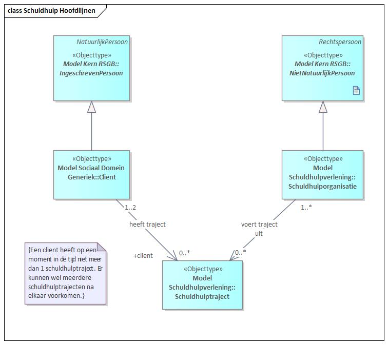
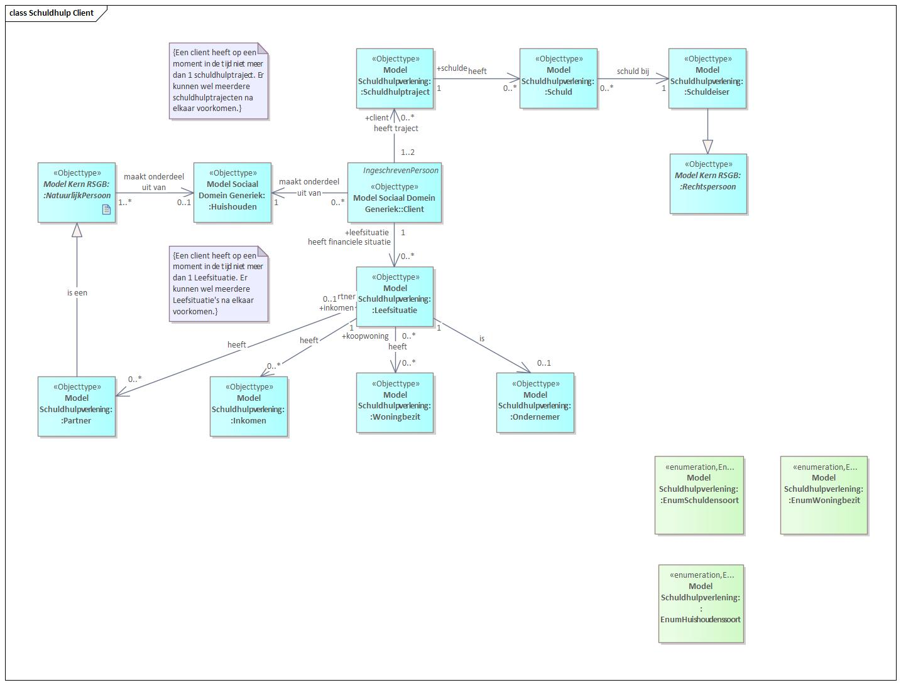
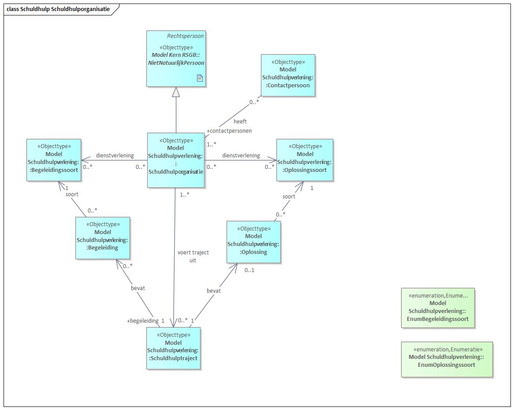

# Schuldhulpverlening

## Achtergrond: DDAS (Data Delen Armoede en Schulden)

[VNG](https://vng.nl), [Divosa](https://www.divosa.nl) en [NVVK](https://www.nvvk.nl) hebben de handen ineengeslagen en zijn in samenwerking met [CBS](https://www.cbs.nl), een initiatief gestart waarmee het delen van data in het armoede- en schuldendomein kan worden verbeterd en datagedreven beleid en uitvoering van gemeenten kan worden gestimuleerd. Dit initiatief heet [DDAS](https://www.divosa.nl/projecten/data-delen-over-armoede-en-schulden), Datadelen op Armoede en Schulden, en startte in 2022 met subsidie van het [Ministerie van SZW](https://www.rijksoverheid.nl/ministeries/ministerie-van-sociale-zaken-en-werkgelegenheid).

De kern van DDAS is de uitvraag van data door de koepelorganisaties te standaardiseren (definities gelijktrekken), te optimaliseren (alleen uitvragen wat nodig is) en flexibiliseren (voor meerdere doelen te gebruiken). Door standaardisatie en optimalisatie wordt de administratieve lastendruk voor gemeenten en andere betrokken partijen verminderd en tegelijkertijd betere kwaliteit van informatie geleverd.

Belangrijk onderdeel van DDAS is het mogelijk maken van datadelen van gemeenten met CBS waardoor op termijn een betrouwbaar landelijk beeld kan worden geschetst van de schulden- en armoedeproblematiek en de ontwikkelingen daarin. Hiertoe worden gegevens over schuldhulpverlening vanuit de schuldhulpverlenende instanties aangeboden aan het CBS, die op basis van deze gegevens statistieken maakt voor het genoemde landelijk beeld.

Hiertoe is een informatiemodel opgesteld dat opgenomen in het GGM en is hieronder beschreven. Meer informatie over DDAS vind je op de [informatiepagina van DDAS](https://vng-realisatie.github.io/ddas/).

## Informatiemodel Schuldhulpverlening

De kern van het informatiemodel Schuldhulpverlening bestaat uit een Schuldhulptraject dat wordt uitgevoerd voor 1 of 2 cliënten. In het geval cliënten getrouwd zijn en aansprakelijk zijn voor elkaars schulden maken zij onderdeel uit van hetzelfde schuldhulptraject. Het kan hier ook gaan om een partner waar inmiddels van is gescheiden, maar waar in het verleden gezamenlijk schulden mee zijn aangegaan. Een client kan tegelijkertijd maar één Schuldhulptraject hebben, maar wel in de tijd volgordelijk meerdere Schuldhulptrajecten hebben doorlopen.

Eén of meer Schuldhulporganisaties leveren het Schuldhulptraject aan de client(en). Vaak zijn er naast de gemeente ook andere partijen die betrokken zijn bij onderdelen van het Schuldhulptraject.

Figuur 2 Hoofdindeling Schuldhulpverlening

Een Client is altijd een Ingeschreven Persoon, zoals bekend in de BRP (Basisregistratie Personen), en heeft de kenmerken die daar zijn vastgelegd. Voor een client geldt echter wel dat niet op alle momenten in het proces al deze gegevens beschikbaar hoeven te zijn. Een Schuldhulporganisatie is een Niet Natuurlijk Persoon (bedrijf, instelling of overheidsorganisatie) en heeft hiervan ook de kenmerken.

## Processen

Het procesdeel van het informatiemodel is gebaseerd op het NVVK-Referentieproces (zie paragraaf 1.4) en geeft uitwerking van de processen die in het kader van een Schuldhulptraject kunnen voorkomen.

Figuur 3 Proces Schuldhulpverlening

Een Schuldhulptraject kan de volgende fasen bevatten: Aanmelding, Intake, Stabilisatie, Schuldregeling, Oplossing en Nazorg. Daarnaast kan het meerdere soorten begeleiding bevatten. Als een Schuldhulptraject een van de volgende zaken bevat: Aanmelding, Intake, Stabilisatie, Schuldregeling, Oplossing of Nazorg, dan impliceert dat de volgorde zoals weergegeven in Figuur 3. Een Schuldhulptraject kan maar één Oplossing hebben, maar er zijn verschillende oplossingen mogelijk, deze zijn vastgelegd in EnumOplossingssoort. De verschillende soorten mogelijke Begeleiding zijn gespecificeerd in EnumBegeleidingssoort.

Daarnaast kan een Schuldhulptraject een Plan van aanpak hebben en een Uitstroomreden. Als er een Uitstroomreden is dan is het Schuldhulptraject beëindigd. Een lijst met de mogelijke uitstroomredenen is vastgelegd in EnumUitstroomreden. Binnen een Schuldhulptraject kunnen meerdere Crisisinterventies plaatsvinden, en er kunnen meerdere Mortuaria onderdeel van zijn.

## Cliënten

Binnen het Informatiemodel Schuldhulpverlening worden de volgende objecttypen vastgelegd rond de Client in het kader van een Schuldhulptraject. Van een client worden niet alle vastgelegde attributen uit de BRP overgenomen. Alleen die attributen worden gebruikt die noodzakelijk zijn om de client te identificeren: BSN en door het geval deze niet beschikbaar is: geboortedatum, geslacht, postcode, huisnummer en huisnummertoevoeging. In Figuur 4 zijn deze uitgewerkt.

Figuur 4 Informatiemodel Client

Allereerst maakt een Client onderdeel uit van een Huishouden. Dat kan een eenpersoonshuishouden zijn of een huishouden dat met meerdere Natuurlijke Personen wordt gedeeld. De verschillende soorten mogelijke huishoudens (Particulier huishouden of Institutioneel Huishouden) zijn vastgelegd in EnumHuishoudenssoort.

In het kader van de Schuldhulpverlening heeft een Client een Leefstituatie. In de tijd kan een Client slechts één vastgelegde Leefstituatie hebben. Na elkaar in de tijd kunnen dat meerdere vastgelegde Leefstituaties zijn. De Leefstituatie kent een volgende objecttypen: informatie over: een mogelijke partner of partners uit het verleden, het inkomen, een mogelijke koopwoning en een mogelijk ondernemerschap. Daarnaast zijn de schulden van de Client van groot belang. Een Client kan meerdere schulden hebben, en ieder van die schulden is bij een Schuldeiser. Een schuldeiser is een Rechtspersoon, dus kan een Natuurlijk Persoon zijn of een Niet Natuurlijk Persoon. De verschillende soorten mogelijke schulden zijn vastgelegd in EnumSchuldensoort en de verschillende soorten mogelijke schuldeisers zijn vastgelegd in EnumSchuleisersoort. De schulden die binnen de scope van het schuldhulptraject vallen, zijn gekoppeld aan het traject. Een schuldhulptraject vindt altijd plaats onder verantwoordelijkheid van een gemeente. (De gegevens over de leefsituatie worden niet aangeleverd aan het CBS, maar verrijkt door het CBS. Deze zijn dan ook niet in de uitwisselspecificatie opgenomen)

## Organisaties

In het informatiemodel Schuldhulpverlening worden de volgende objecttypen en relaties vastgelegd over de schuldhulp verlenende organisatie. Van een organisatie worden niet alle kenmerken zoals vastgelegd in de NHR overgenomen, alleen kvk-nummer, naam en als het een gemeente betreft de gemeentecode, deze zijn in Figuur 5 uitgewerkt.

Figuur 5 Schuldhulpverlenende Organisatie

In bovenstaande figuur worden de volgende zaken weergegeven: Een Schuldhulporganisatie kan meerdere schuldhulptrajecten uitvoeren. Een Schuldhulporganisatie kan als dienstverlening meerdere soorten begeleiding en meerdere soorten oplossingen aanbieden. Alle Oplossingen binnen een Schuldhulptraject zijn van een bepaald soort, en hetzelfde geldt voor Begeleiding. De soorten mogelijke begeleiding zijn vastgelegd in EnumBegeleidingssoort en de soorten oplossingen in EnumOplossingssoort.