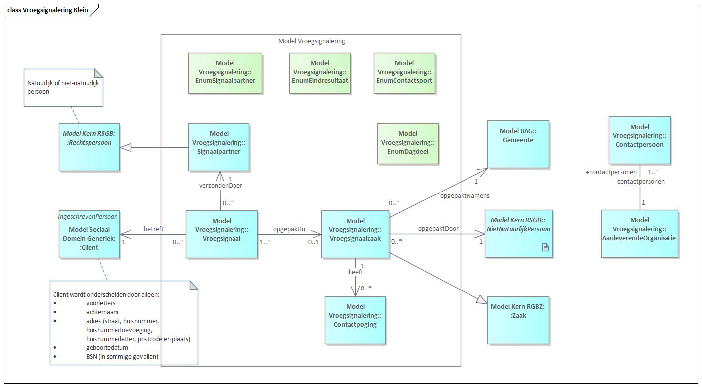
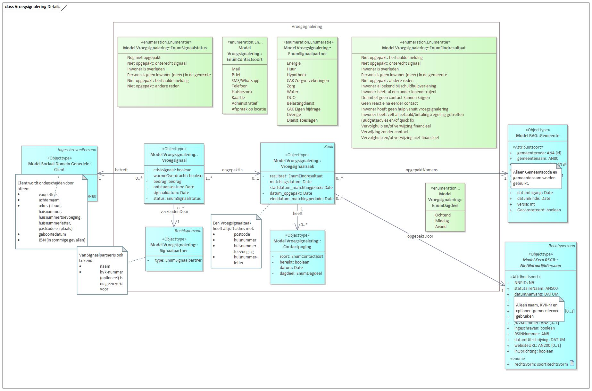

# Early Warning

At the core of the Early Warning information model are *Early Signal* and *Early-Signal Case*. Early signals are submitted by *Signal Partners*. Signals concern a particular *Client* for whom at least address data is available. Subsequently, at a given interval, all early signals on behalf of a municipality are picked up in an *Early-Signal Case*. Within a case, a number of contact attempts are made to reach the client.

Early signals have a status that always starts with *"Not yet picked up"* and ends with one of the other statuses from *EnumSignalStatus*. The same goes for early-signal cases, starting always with *"Not yet picked up"* and ending with another status.

<em>Figure 1 (in Dutch): main structure of Early Warning — Signal, Case, Client, Signal Partner.</em>

Figure 2 shows the information model for early warning in more detail.

<em>Figure 2 (in Dutch): detailed Early Warning information model.</em>
