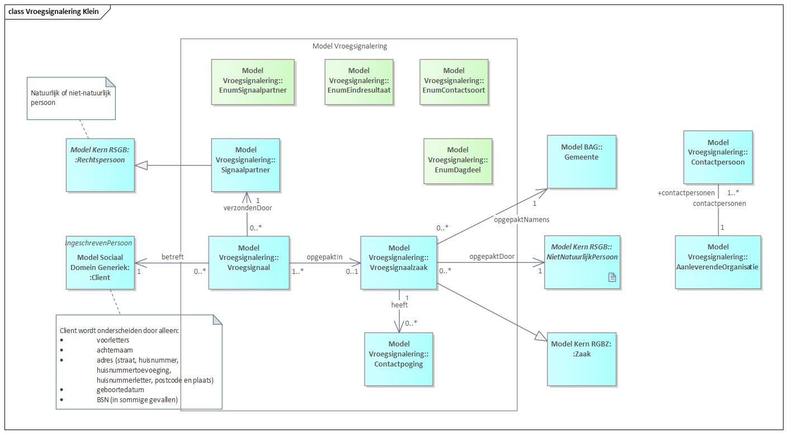
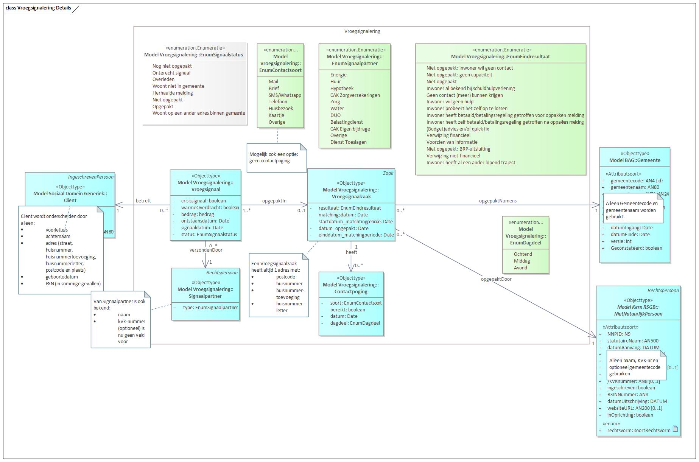

# Vroegsignalering

De kern van het informatiemodel Vroegsignalering bestaat uit Vroegsignaal en uit Vroegsignaalzaak. Vroegsignalen worden door de Signaalpartners aangeboden. Vroegsignalen betreffen een bepaalde Client, waarvan tenminste de adresgegevensbeschikbaar zijn. Vervolgens worden ovr een bepaald interval alle vroegsignalen namens een gemeente opgepakt in een Vroegsignaalzaak. Binnen een Vroegsignaalzaak wordt er in een aantal contactpogingen contact gezocht met de Client.  

De vroegsignalen hebben een bepaalde status die, die altijd start met: "Nog niet opgepakt" en eindigt met een van de andere statussen uit EnumSignaalstatus. Hetzelfde geldt voor vroegsignaalzaken, die beginnen ook altijd met "Nog niet opgepakt" en eindigen met een andere status.   

Figuur 1 Hoofdindeling Vroegsignalering

In Figuur 2 wordt het informatiemodel voor vroegsignalering in meer detail getoond.

Figuur 2 Vroegsignalering in details
