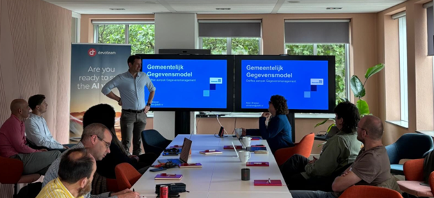

# GGM toegepast: Databricks for Public

**Ronde Tafel: Data en AI als Motor voor de Toekomstgerichte Gemeente**

**Slimmer Beslissen in een Complex Overheidslandschap met Databricks & Devoteam**

Op dinsdag 27 mei 2025 organiseerden Databricks en Devoteam een exclusieve ronde tafel op het Databricks-kantoor in Amsterdam. Beleidsmakers, strategen en data-experts uit diverse gemeenten gingen in gesprek over de centrale vraag: Hoe kunnen data en AI bijdragen aan een toekomstgerichte, afdelingsoverstijgende aanpak binnen uw gemeente? De gemeente Hilversum deelde haar praktijkervaring met het Gemeentelijk Gegevensmodel (GGM) en de modernisering van haar dataplatform met Databricks.

**Gemeentelijke Uitdagingen: Van Fragmentatie naar Datagedreven Samenwerking**

Gemeenten staan voor complexe opgaven in het sociaal en fysiek domein, zoals vroegsignalering in schuldhulpverlening, samenwerking tussen jeugdzorg en onderwijs, en het meten van beleidsresultaten. De roep om datagedreven werken groeit, mede door landelijke afspraken en de noodzaak om gegevens uit verschillende bronnen te combineren en te ordenen. Dit vraagt om:

- Betere verwerking en ordening van data
- Verbetering van datakwaliteit 
- Standaardisatie en integratie tussen afdelingen en gemeenten

**Open Source Versnelt Innovatie en Samenwerking**

Het Gemeentelijk Gegevensmodel (GGM) is een open source gegevensmodel dat speciaal is ontwikkeld voor en door gemeenten. Omdat gemeenten grotendeels met dezelfde beleidsdomeinen werken, ontstaat er een natuurlijke behoefte aan een uniform en herbruikbaar model. Door gezamenlijk één gegevensmodel te gebruiken, kunnen gemeenten efficiënter samenwerken en kennis delen. Een effectieve datastrategie, gecombineerd met het GGM, vormt de basis voor een toekomstbestendige informatievoorziening.  

**Bouw een Sterk Fundament met Gecentraliseerd Data Governance**

In een omgeving waar data uit talloze bronnen samenkomt, is het beheren van data en AI-assets zonder een centraal platform vrijwel onmogelijk. Een gecentraliseerd governance platform biedt één plek voor toegangsbeheer, auditing, lineage en data discovery over alle afdelingen heen. Dit zorgt voor veilig, compliant en transparant datagebruik, voorkomt versnippering en maakt samenwerking eenvoudiger. Zo kunnen gemeenten efficiënt voldoen aan wet- en regelgeving, terwijl ze flexibel blijven inspelen op veranderende informatiebehoeften. 

Databricks biedt een centraal dataplatform dat is gebouwd op open-source technologieën zoals Delta Tables en Unity Catalog. Met Delta Tables kunnen gemeenten data efficiënt en betrouwbaar opslaan en bewerken. Unity Catalog voegt hier een krachtige laag voor data governance aan toe, waarmee toegangsrechten, data lineage en compliance centraal geregeld kunnen worden, ongeacht het type gebruiker of afdeling. Op deze manier krijgen uiteenlopende datagebruikers, zoals analisten, data scientists en beleidsmakers, eenvoudig en veilig toegang tot precies die data die zij nodig hebben. Dit alles gebeurt binnen de gestelde kaders van governance en security, zodat gemeenten controle houden over hun gegevens en voldoen aan wet- en regelgeving.  

De praktijk wijst uit: een gecentraliseerd governance platform is onmisbaar om datagedreven werken schaalbaar, veilig en toekomstbestendig te maken.

**Case Hilversum: van versnipperd datalandschap naar een krachtige data Lakehouse**

Hilversum, bekend als mediastad in het groen, stond voor de uitdaging om data uit verschillende bronnen te ontsluiten en te integreren. De bestaande situatie bestond uit meerdere losstaande datawarehouses, beperkte samenwerking tussen teams en een moeizame aansluiting van externe bronnen. Met de overstap naar een cloud-based data lakehouse, gebouwd met Databricks en Devoteam, heeft Hilversum:  

- Een centrale data-architectuur met duidelijke scheiding tussen bronsystemen (bronze), gestandaardiseerde data (silver/GGM) en beleidsinformatie (gold) 
- Inzicht in uitgaven en trends over domeinen als Sociaal Domein, Financiën, Veiligheid, Bedrijfsvoering en Subsidies 
- Realtime inzichten en dagelijkse dashboards die beleidsmakers ondersteunen met actuele informatie voor gerichte sturing en verantwoording 
- Snellere en beter onderbouwde besluitvorming dankzij betrouwbare data en geavanceerde analysemogelijkheden 
- Verbeterde samenwerking met interne afdelingen én externe partners, door veilige en gecontroleerde gegevensdeling 
- Een toekomstbestendige datavoorziening die flexibel meebeweegt met veranderende informatiebehoeften

Belangrijkste les en reflectie op GGM   Een succesvolle GGM implementatie vraagt om actieve betrokkenheid van zowel de business als IT, én een duidelijke roadmap naar een datavolwassen organisatie. Hoewel het GGM veel voordelen biedt, ervaren gemeenten in de praktijk ook weleens uitdagingen, zoals het integreren van versnipperde databronnen, het realiseren van organisatiebreed draagvlak en het waarborgen van datakwaliteit en governance. De implementatie vraagt om investeringen in kennis, samenwerking en tijd. Databricks biedt hierbij cruciale ondersteuning.

**Zet de Volgende Stap: Maak Datagedreven Werken de Standaard**

De roundtable toonde aan dat datagedreven werken, ondersteund door het Databricks-platform en het GGM, gemeenten helpt om sneller, transparanter en effectiever beleid te voeren. De ervaring van Hilversum biedt een inspirerend voorbeeld voor collega-gemeenten die hun informatiehuishouding willen professionaliseren en toekomstbestendig willen maken.   

Wij nodigen alle gemeenten uit om de stap te zetten naar datagedreven werken en samen te bouwen aan een innovatieve, wendbare en toekomstbestendige overheid.  

**Over Databricks en Devoteam**

Databricks is toonaangevend in data intelligence en AI voor de publieke sector en biedt een platform voor unified governance, open data sharing en compliance. Devoteam begeleidt organisaties bij de architectuur en implementatie van AI-gedreven transformaties.