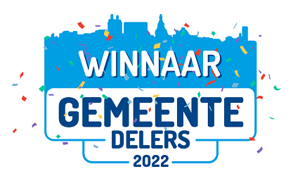

# Delft Municipal Data Model

The **Delft Municipal Data Model** (Dutch: *Gemeentelijk Gegevensmodel*, abbreviated **GGM**) is a logical data model representing all policy areas of a municipality. The abbreviation *GGM* — Dutch in origin — is also used throughout this site (in file names, URLs, and tooling) to remain aligned with the source artefacts.

The GGM was developed on behalf of the Municipality of Delft in support of the vision for data-driven working. Among other uses, it serves as the central data model in the data warehouse. A generator is available to translate the GGM into physical database tables.

The GGM covers all policy areas that fall under municipal responsibility, regardless of how the organisation is structured (departments performing the tasks, outsourcing to third parties). These policy areas are derived from the [IV3 task fields](https://www.rijksoverheid.nl/onderwerpen/financien-gemeenten-en-provincies/uitwisseling-financiele-gegevens-met-sisa-en-iv3/informatie-voor-derden-iv3) (Dutch national municipal reporting taxonomy).

A set of *code-generation templates* has been developed alongside the GGM, with which physical data models can be generated from (parts of) the GGM. These produce DDL for several RDBMSs. We have used Oracle, and the templates are also available — untested — for MySQL, with various extensions on top. The templates target the [Code Template Framework](https://sparxsystems.com/enterprise_architect_user_guide/15.0/model_domains/codetemplates_2.html) of Enterprise Architect.

  

<em>Image: award badge "Winner Gemeentedelers 2022" — a Dutch annual prize for reusable initiatives among municipalities.</em>

## Common Ground Gold status

The Common Ground Expert Review Group reviewed the GGM initiative and decided to award it the *Gold* classification on the [Common Ground portfolio](https://commonground.nl/page/view/b68441ec-e536-4f81-82d8-ce6f3d6606a9/portfolio). This classification reflects the assessment against the architecture and realisation principles. The conclusion was reached on the basis of the answers received during the review.

## Structure of the GGM

The GGM has a layered structure, in which object types from different policy domains are decoupled as much as possible. Only object types in the lowest layers of the model are reused by the layers above.

![Layering of Domains][gelaagdheidDomeinen]

<em>Diagram (in Dutch): "Gelaagdheid Domeinen" — the layered structure of the model. Horizontal layers (Core/Kern, Finance/Financiën, ICT, Service Delivery/Dienstverlening) form the foundation; vertical policy domains build on top.</em>

The data model is organised into a number of vertical policy domains and four horizontal foundational domains. The horizontal layers (Core, Finance, ICT and Service Delivery) form the basis on which the vertical domains build. The Core consists of RSGB and RGBZ, which contain the data definitions used for the basic registrations (RSGB) and case-oriented working (RGBZ).

Decoupling between the various (sub)domains is pursued by ensuring that data definitions in a (sub)domain only reference definitions from underlying (sub)domains. All (sub)domains use definitions from the Core, and all vertical (sub)domains may use definitions from the four horizontal models.

### Policy domains

The data model covers the following policy areas based on the [IV3 task fields](https://www.rijksoverheid.nl/onderwerpen/financien-gemeenten-en-provincies/uitwisseling-financiele-gegevens-met-sisa-en-iv3/informatie-voor-derden-iv3):

* **Governance, politics and support**: Domain that contains data captured during, and resulting from, governance and political processes and policy formation, plus data recorded for municipal civil-affairs tasks.
    * **[Civil Affairs](domeinen/burgerzaken.en.md)**: Information domain covering the registration and service delivery related to the personal lives of residents — focused on recording and issuing official documents and information.
    * [Council Office](domeinen/griffie.en.md): Information domain covering the support of the municipal council and the organisation of council processes — focused on facilitating decision-making and democratic oversight.
* **Safety and permits**: Information domain covering the safeguarding of safety, enforcement of regulations and crisis management.
    * **[Public Order and Safety](domeinen/vth.en.md#public-order-and-safety)**: Covers municipal tasks in the area of public order and safety. Includes oversight and enforcement of public order, deployment of municipal enforcement officers (BOAs) and city wardens, execution of the Bibob Act and the administrative approach to organised crime. Also covers crime prevention, enforcement of the local Public Order By-laws (APV), permit issuance for events and hospitality, and policy and oversight on conventional explosives.
    * **[Building Permits](domeinen/vth.en.md#permit-applications)**: Information domain covering applications, assessment and issuance of permits for building activities such as construction, renovation or demolition.
    * **[Other municipal permits](domeinen/vth.en.md#permit-applications)**: Information domain covering applications, assessment and conditions for various municipal permits for activities in the public space.
* **Traffic, transport and water**: Information domain covering infrastructure, mobility and water management — supporting accessibility and transport efficiency.
    * **[Mobility](domeinen/mobiliteit.en.md)**: Information domain covering the structure, definitions and relationships of data on the movement of people and goods — focused on facilitating efficient and sustainable mobility.
    * **[Parking](domeinen/parkeren.en.md)**: Information domain covering the stationary placement of vehicles in designated areas — to regulate parking space and promote liveability, accessibility and mobility within the municipality.
* **[Economy](domeinen/economie.en.md)**: Information domain covering economic development, business activity and innovation.
* **Education**: Information domain covering educational facilities, pupil flows, tasks in the education sector and educational support.
    * **[Compulsory Education and Pupil Transport](domeinen/leerplicht.en.md)**: Information domain covering compliance with the compulsory-education law and the organisation of pupil transport — to ensure access to education for all children and young people.
    * **[Education](domeinen/onderwijs.en.md)**: Information domain covering primary and secondary education — focused on guaranteeing access to and quality of education for children and young people.
* **Sport, Culture and Recreation**: Information domain covering tasks related to heritage, sport activities, cultural facilities and recreational opportunities.
    * **Heritage**
        * **[Archaeology](domeinen/archeologie.en.md)**: Information domain covering archaeological excavations, research and decision-making — focused on the preservation, protection and disclosure of archaeological heritage within the framework of the Heritage Act.
        * **[Archives](domeinen/archief.en.md)**: Information domain covering the formation, management, accessibility and sustainable preservation of archives, including documents and collections of cultural-historical value.
        * **[Monuments](domeinen/monumenten.en.md)**: Information domain covering the designation, protection and maintenance of monuments — including buildings, objects and landscapes — that are of cultural-historical, scientific or aesthetic value.
    * **[Museums](domeinen/musea.en.md)**: Information domain covering the acquisition, management, research and presentation of museum collections and exhibitions within a public-sector organisation.
    * **[Sport](domeinen/sport.en.md)**: Information domain covering sports policy, sports facilities and activities aimed at promoting sport and physical exercise — to enhance the health, social cohesion and participation of residents.
* **Social Domain**: Information domain covering care, support, well-being and social participation for individuals and groups.
    * **[Wmo (Social Support)](domeinen/wmojeugd.en.md)**: Information domain covering the support and care municipalities provide under the Social Support Act (Wmo) to promote self-reliance and societal participation — aiming to allow people to live independently at home for as long as possible.
    * **[Youth](domeinen/wmojeugd.en.md)**: Information domain covering support, assistance and protection for young people and their families under the Youth Act (Jeugdwet).
    * **[Income](domeinen/inkomen.en.md)**: Information domain covering income provisions, schemes and financial support for residents — to safeguard subsistence and societal participation.
    * **[Employment](domeinen/werk.en.md)**: Information domain covering support for finding and keeping work under the Participation Act (Participatiewet) — focused on promoting labour-market participation.
    * **[Debt Counselling](domeinen/schuldhulp.en.md)**: Information domain covering support and guidance for residents with problematic debts — focused on financial stability and societal participation.
    * **[Social Teams](domeinen/socteam.en.md)**: Information domain covering the integrated support that social teams provide to residents — focused on self-reliance, participation and resolving complex problems.
    * **[Municipal Burials](domeinen/gemeentebegraven.en.md)**: Information domain covering municipal funerals — performed when no one else arranges the burial, as set out in the Burial and Cremation Act.
    * **[Homelessness](domeinen/dakloos.en.md)**: Information domain covering people without a fixed address — to map the size, characteristics and support needs of this group.
    * **[Civic Integration](domeinen/inburgering.en.md)**: Information domain covering execution of the Civic Integration Act — supporting newcomers in their integration and participation in Dutch society.
    * **Youth Protection and Probation**: Information domain covering the execution of child-protection measures — to safeguard the safe development of children and young people.
* **Public Health and Environment**: Information domain covering public health, waste management and environmental protection.
    * **[Waste](domeinen/afval.en.md)**: Information domain covering municipal tasks for the collection and processing of business and household waste.
* **Housing, living environment and urban renewal**: Information domain covering housing, spatial planning and the improvement of the living environment in urban or rural areas.
    * **[Public Space](domeinen/ruimteAlgemeen.en.md)**: Information domain covering: (1) the physical objects in public outdoor space — their characteristics, location and condition; and (2) the processes and activities for maintaining, designing and managing these objects.
    * **[Building and Housing](domeinen/bouwenenwonen.en.md)**: Information domain covering the planning, development and execution of housing construction projects — focused on delivering sufficient, affordable and sustainable homes.
    * **[Environment Act](domeinen/omgevingswet.en.md)**: Information domain covering execution of the Dutch Environment and Planning Act (*Omgevingswet*) — focused on integral management and development of the physical living environment.
    * **Public Space Reports**: Information domain covering reports from residents or organisations about issues in the public space — focused on maintaining a clean, intact and safe living environment.
* **Internal Organisation**: Information domain covering the internal processes and supporting functions that enable the organisation to function.
    * **[ICT](domeinen/ict.en.md)**: Information sub-domain covering the IT and communication systems supporting internal processes and information provision.
    * **[Municipal Real Estate](domeinen/vastgoed.en.md)**: Information domain covering the management, maintenance and operation of buildings and grounds owned by the organisation.
    * **[Finance](domeinen/financien.en.md)**: Information sub-domain covering financial processes, planning and control, and financial management.
    * **[HR](domeinen/hr.en.md)**: Information sub-domain covering the management and development of personnel — supporting the organisation and its employees.
    * **[Procurement](domeinen/inkoop.en.md)**: Information sub-domain covering the process of acquiring goods, services and works.
    * **[Subsidies](domeinen/subsidies.en.md)**: Information domain covering the process of applying for, assessing, granting, managing and accounting for subsidies — both as grantor and grantee.
    * **Facilities (_under development_)**: Information domain covering the supporting services and facilities that contribute to an optimal working environment for staff and visitors.
    * **Control (_under development_)**: Information domain covering internal control and steering of the organisation — to safeguard achievement of organisational objectives.
    * **Organisation Structure**: Information domain covering the structure and breakdown of the organisation, including the design and execution of programmes and projects.
* **[Service Delivery](domeinen/dienstverlening.en.md)**: Information domain covering reports, applications, counter contacts, telephone handling and digital interactions that facilitate other domains.

In addition to the policy areas above, the GGM contains a *Core* section in which all shared object types live. The Core derives from the [Information Model for Basic and Core Data (RSGB)](https://www.gemmaonline.nl/index.php/Informatiemodel_Basis-_en_Kerngegevens_(RSGB)) and the [Information Model for Cases (RGBZ)](https://www.gemmaonline.nl/index.php/Informatiemodel_Zaken_(RGBZ)) — both part of [GEMMA: the Dutch Municipal Reference Architecture](https://www.gemmaonline.nl/index.php/Gemeentelijke_Model_Architectuur_(GEMMA)) — supplemented with a number of generic object types.

### Applied national standards

The Netherlands currently has a patchwork of standards for data exchange and information modelling. Coherence between these standards is limited. Where possible, relevant standards are integrated coherently within the GGM domains. The basic-registrations system and the RSGB based on it provide some structure here, which is why the RSGB occupies a central place in the GGM.

The following standards have been used during the development of the GGM and form part of it:

* [Information Model for Basic and Core Data (RSGB)](https://www.gemmaonline.nl/index.php/Informatiemodel_Basis-_en_Kerngegevens_(RSGB)) version 2.0.2. The RSGB has been used as-is in the *Core* part of the GGM. A few changes based on RSGB 3.0 were applied for the [*Public Space* domain](domeinen/ruimteAlgemeen.en.md#geo-objects), and additions were made for fees and precario (these were not previously supported).
* [Information Model for Cases (RGBZ)](https://www.gemmaonline.nl/index.php/Informatiemodel_Zaken_(RGBZ)) version 1.0. RGBZ has been used as-is in the *Core* of the GGM.
* [iWmo](https://www.istandaarden.nl/iwmo) version 2.3 — message standard for data exchange between healthcare providers and municipalities, with an underlying information model. Together with iJw, this forms the basis for the Youth and Wmo part of the *Social Domain*. Various object types have been added during elaboration.
* [iJw](https://www.istandaarden.nl/ijw) version 2.3. See iWmo.
* [iPgb](https://www.istandaarden.nl/ipgb) version 1.0. The information models for the granting message (TKB) and the budget closing message (BAB) have been applied.
* [Suwi Data Register (SGR)](https://bkwi.nl/standaarden/suwi-gegevensregister-sgr) version 4.0. The SGR is a data model from the Work and Income chain, serving as a shared frame for messages in [SuwiML](https://bkwi.nl/standaarden/suwi-gegevensregister-sgr). The XSD message schemas were used to derive the relevant object types.
* [Public Space Management Information Model (IMBOR)](https://www.crow.nl/thema-s/management-openbare-ruimte/imbor) version 1.2.04 — naming, definitions and relations of management data linked to objects in the public space. Built on top of object types from the Large-scale Topographic Base Registration (BGT) and the Geo Information Model (IMGeo), both part of the RSGB. The GGM links RSGB objects to IMBOR.
* [Standard and Information Model for Applicable Rules (STTR/IMTR)](https://aandeslagmetdeomgevingswet.nl/digitaal-stelsel/technisch-aansluiten/koppelvlakken/toepasbare-regels/standaard/) version 1.02. Used for the Environment Act question-tree functionality of the *Omgevingsloket*. Adopted partially due to limited scope.
* [Standard and Information Model for Applications and Reports (STAM/IMAM)](https://aandeslagmetdeomgevingswet.nl/digitaal-stelsel/technisch-aansluiten/koppelvlakken/vergunningen/standaard/) version 0.9. STAM and IMAM support the submission of permit applications or notifications under the Environment Act.
* [Standard for Official Publications (STOP/TPOD)](https://aandeslagmetdeomgevingswet.nl/digitaal-stelsel/technisch-aansluiten/koppelvlakken/omgevingsdocumenten/standaard-officiele/) version 0.98beta — for validating and publishing Environment Act decisions. Adopted partially due to limited scope.
* [Conceptual Information Model for the Environment Act (CIMOW)](https://geonovum.github.io/TPOD/CIMOW/IMOW_v2.0.2.pdf) version CIMOW v0.98-core. Describes the Environment Act domain — the information that is recorded, established and exchanged in chains for the digital system of the Environment Act (DSO).
* [GML 3.2.1 (Geography Markup Language)](https://www.geonovum.nl/geo-standaarden/geography-markup-language-gml/gml-encoding-standard-321) — describes how geographic locations, lines, surfaces and combinations are recorded and exchanged. Standardised by OGC and (through OGC/ISO co-operation) by ISO as ISO 19136:2007. The ISO variant is on the Dutch *comply-or-explain* list of the Standardisation Forum.
* [NEN 3610: 2011 (Base model for geo-information)](https://www.geonovum.nl/geo-standaarden/nen-3610-basismodel-voor-informatiemodellen) — terms, definitions, relations and general rules for the exchange of information about spatial objects. NEN 3610 is on the *comply-or-explain* list.
* [IMBGT/IMGeo version 2.1.1](https://www.geonovum.nl/geo-standaarden/bgt-imgeo/gegevenscatalogus-imgeo-versie-211) — the BGT defines information available through the BGT base registration, serving as a base layer for the other models.
* [IMBAG version 0.99 (Data Catalogue Base Registration of Addresses and Buildings)](https://www.geonovum.nl/geo-standaarden/informatiemodellen-nen3610-familie/gegevenscatalogus-basisregistratie-adressen-en) — the BAG contains all addresses and buildings in the Netherlands. The data catalogue defines the agreements for digital exchange. Built on NEN 3610 principles.
* [MIM (Metamodel for Information Models)](https://www.geonovum.nl/geo-standaarden/metamodel-informatiemodellering-mim) — applied in the elaboration of the ICT part. The GGM is not (yet) MIM-compliant.
* [RiHA 2.0 (Data model for supervision and enforcement)](https://samenwerken.pleio.nl/groups/view/8b832827-e91b-476c-bb4f-c228b8e5e934/standaardisatie-toezicht-handhaving-milieu/wiki/view/2b38214e-cfc7-42ff-9d5d-eaf069671c42/riha-referentieinformatiemodel-handhaving) — applied in the elaboration of permits, supervision and enforcement.

## Origin of the GGM

The GGM was designed on the basis of interviews with domain experts, the applications used in Delft, and national information standards. The aim was a data model with strong grounding in the Delft situation. Since all Dutch municipalities essentially share the same statutory tasks, we assume that the underlying information models will be largely similar elsewhere.

The starting points of the inventory were:

1. The list of Delft applications and their inventory, distinguishing between authoritative sources and other applications.
2. The set of policy domains in which the municipality has tasks.
3. Nationally established standards for data exchange and nationally established information models.

The inventory was carried out broadly in the following steps (see the [full overview](./cookbook/totstandkoming.en.md)):

1. **Expert interviews** per policy domain — conversations with information-management experts to inventory the applications used, the users involved, the interactions between applications and users, and the data used.
2. **Applications and data** — by identifying authoritative sources during the conversations, zooming in on the data used, and using the application/data inventory, the data within authoritative sources were identified.
3. **Data model** — built up by translating the data found in the previous step into object types. National standards serve as the starting point as much as possible. Many applications support these standards, maximising compatibility.
4. **Database schema** — a generator was built that produces database tables 'at the press of a button' from the model definitions. This makes it possible to lay the foundation for a data warehouse and load data from applications, enabling confrontation of the model with real data.

![GGM Approach 1][aanpakGGM]

<em>Diagram (in Dutch): "Aanpak GGM" — the GGM development approach: interviews → application & data inventory → data model → database schema generation.</em>

[importXMI]: image/ImportPackage.png "Import XMI via Publish tab"
[selectFilename]: image/SelectFilename.png "Select Filename"
[importPackage]: image/ImportPackage.png "Import Package"
[openDiagram]: image/OpenDiagram.png "Open Diagram"
[gelaagdheidDomeinen]: image/GelaagdheidDomeinen.jpg "Layering of Domains"
[aanpakGGM]: image/AanpakGGM.jpg "GGM Approach"
[importRefData]: image/ImportRefData.png "Import Reference Data"
[kiesTemplates]: image/KiesTemplates.png "Choose templates"
[gebruikTemplates]: image/GebruikTemplates.png "Use templates"
