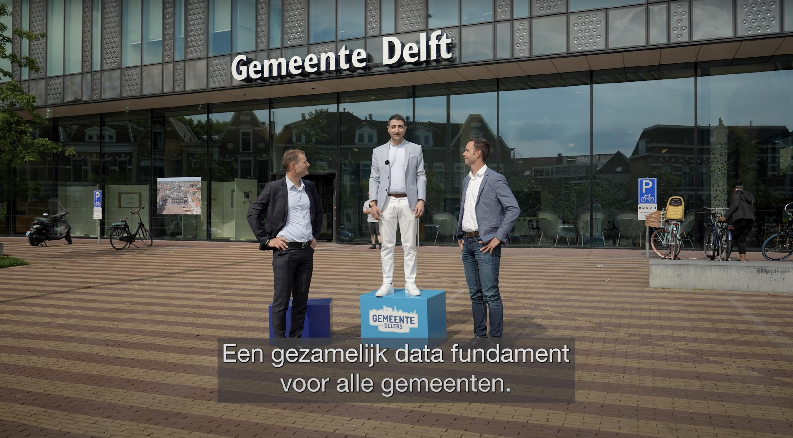

---
hide:
  - toc
---

# Gemeentelijk Gegevensmodel (GGM)

> **Het standaard informatiemodel voor gemeenten**

Het Gemeentelijk Gegevensmodel (GGM) is het standaard informatiemodel voor alle 22 beleidsdomeinen van Nederlandse gemeenten. Het biedt één centrale, openbare taal voor hoe gemeentelijke data gedefinieerd, vastgelegd en uitgewisseld moeten worden.  

Het GGM is geen software of applicatie, het is een afgesproken structuur die ervoor zorgt dat alle systemen van een gemeente dezelfde taal spreken. Hieronder vallen alles van burgerzaken en werk & inkomen tot ruimtelijke ordening en het sociaal domein.  

Het model is volledig open source, gratis beschikbaar, en onderdeel van het Common Ground-stelsel.

---

  

---

## Wat is het Gemeentelijke Gegevensmodel

Het GGM helpt gemeenten om gegevens los te maken van individuele systemen en ze betekenisvol te verbinden voor analyse, uitvoering en beleid.

- Eén samenhangend informatiemodel voor alle gemeentelijke beleidsdomeinen  
- Gericht op eenduidige betekenis, niet op specifieke applicaties  
- Opensource en publiek beschikbaar  
- Ontwikkeld vanuit de praktijk, toegepast door steeds meer gemeenten  

### Gemeentelijk Gegevensmodel in getallen

- 22 beleidsdomeinen - volledige dekking van alle gemeentelijke taken
- 2.000+ gedefinieerde objecttypen met exacte datatypen en validatieregels
- 17 landelijke standaarden geïntegreerd (RSGB, RGBZ, iWmo, iJw, iPgb, Suwi, en meer)
- 150+ gemeenten en organisaties in actieve gebruikersgroep
- 500+ deelnemers op Pleio-community (88% van de 50.000+ gemeenten en 64% van alle gemeenten)

### Goud-status Common Ground

Het Gemeentelijk Gegevensmodel is gecertificeerd als Goud-initiatief door de Common Ground Expert Review Groep. Dit getuigt van excellentie in architectuur- en realisatieprincipes, en maakt het GGM een betrouwbare en toekomstvaste keuze voor gemeenten.

### Winnaar Gemeentedelers 2022

Gemeente Delft is winnaar van de [GemeenteDelers](https://www.gemeentedelers.nl) competitie van VNG Realisatie. Delft deed mee in de categorie Informatietechnologie met het Gemeentelijk Gegevensmodel (GGM). Met het GGM bouwen we aan een gezamenlijk datafundament dat informatie gestuurd werken ondersteund. En het goede nieuws: ook andere gemeenten kunnen gebruik maken van dit open source model.

  

---
## GGM in de pers

Het GGM krijgt de afgelopen jaren toenemende aandacht in vakmedia en bestuurlijke publicaties. Dit laat zien dat het GGM zich ontwikkelt van een lokaal initiatief naar een **breed gedragen standaard** binnen het gemeentelijk datalandschap. Enkele voorbeelden:

- **iBestuur** beschrijft waarom steeds meer gemeenten aan de slag gaan met het GGM en hoe het bijdraagt aan datagedreven werken en Common Ground  
  <https://ibestuur.nl/data-en-ai/vng/waarom-gemeenten-aan-de-slag-gaan-met-het-gemeentelijk>

- **VNG** laat zien hoe het GGM in de praktijk wordt toegepast en welke lessen gemeenten daarbij leren  
  <https://vng.nl/praktijkvoorbeelden/het-gemeentelijk-gegevensmodel>

- **Computable** signaleert dat het GGM sterk in opmars is en steeds breder wordt omarmd door gemeenten en leveranciers  
  <https://www.computable.nl/2024/10/22/gemeentelijk-gegevensmodel-sterk-in-opmars/>

- **VDP (Vereniging Directeuren Publieksdiensten)** positioneert het GGM als bouwsteen voor een gezamenlijk datafundament in het publieke domein  
  <https://www.publieksdiensten.nl/kennisbank/het-gemeentelijk-gegevensmodel-bouwt-aan-een-gezamenlijk-datafundament/>

## Wat zeggen andere gemeenten?

> "Met het GGM hebben we ons datawarehouse veel effectiever ingericht. 
> We kunnen nu veel sneller inzichten genereren voor beleidsmakers - 
> dingen die eerst weken duurden gaan nu in uren."
>
> — CIO Gemeente Delft (Origineel GGM-ontwikkelaar)

---

> "Het GGM helpt ons om vendor-onafhankelijk te blijven en makkelijker 
> nieuwe systemen te integreren. We hebben minder custom integratie-code nodig."
>
> — Enterprise Architect, Gemeente Utrecht

---

> "Met het GGM kun je veel gemakkelijker verbanden leggen. Wanneer bepaalde 
> datasets semantisch overeenkomen, wordt het makkelijker om verbanden te leggen. 
> Zo kan bijvoorbeeld worden vastgesteld dat iemand die in aanmerking komt voor 
> een stadspas, ook recht heeft op een energietoeslag."
>
> — Jan Verbeek, Lead Architect Zaakgericht Werken (Den Haag & Utrecht)

---

> "Met het GGM kun je sneller afgewogen ruimtelijke beslissingen nemen. 
> Energietransitie, vergroening tegen hittestress, waterberging bij overlast - 
> het model helpt zien hoe deze vraagstukken samenhangen in schaarse ruimte."
>
> — Arjan de Bruin, Data Architect Gemeente Leiden

---

## Internationale Erkenning

Het GGM trekt ook buiten Nederland aandacht. De Noorse gemeente Trondheim heeft 
het GGM geadopteerd voor hun eigen datamodel, wat bewijst dat het concept universeel 
toepasbaar is.