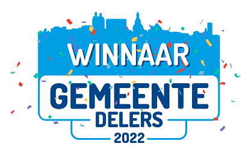

# Gemeentelijk Gegevensmodel

Het Gemeentelijk Gegevensmodel (GGM) is een logisch gegevensmodel met daarin alle beleidsterreinen van de gemeente vertegenwoodigd. Het GGM is ontwikkeld in opdracht van de Gemeente Delft ter ondersteuning van de visie op het gebied van informatiegestuurd werken. Onder andere wordt het GGM gebruikt als centraal datamodel in het datawarehouse. Hiertoe is een generator beschikbaar om het GGM te vertalen naar fysieke databasetabellen.

Het GGM omvat alle beleidsterreinen die onder de verantwoordelijkheid van de gemeente vallen. Dit ongeacht de organisatorische inrichting, zoals de afdelingen die de bijbehorende taken uitvoeren en uitbesteding aan derde partijen. Deze beleidsterreinen zijn afgeleid van de [IV3-taakvelden](https://www.rijksoverheid.nl/onderwerpen/financien-gemeenten-en-provincies/uitwisseling-financiele-gegevens-met-sisa-en-iv3/informatie-voor-derden-iv3).

Bij het GGM is een set _codegeneratietemplates_ ontwikkeld voor het genereren van fysieke datamodellen op basis van (onderdelen van) het GGM. Hiermee genereer je DDL voor diverse RDBMS'en. Wij gebruikten Oracle en in ongeteste vorm zijn de templates beschikbaar voor MySQL, en maakten hier diverse aanvullingen voor. Het gaat hier om templates voor het [Code Template Framework](https://sparxsystems.com/enterprise_architect_user_guide/15.0/model_domains/codetemplates_2.html) van Enterprise Architect.

  

## Goud-status Common Ground

De Expert Review Groep van de Common Ground heeft het initiatief GGM besproken en besloten het initiatief de classificatie Goud te geven op het [Common Ground portfolio](https://commonground.nl/page/view/b68441ec-e536-4f81-82d8-ce6f3d6606a9/portfolio). Deze classificatie is gerelateerd aan de toets op de architectuur en realisatie principes. We zijn tot deze conclusie gekomen op basis van de ontvangen antwoorden. 

## Opbouw Gemeentelijk Gegevensmodel

Het GGM kent een gelaagde opbouw, waarbij verschillende objecttypen over beleidsdomeinen heen zoveel mogelijk zijn ontkoppeld. Alleen objecttypen in de onderste lagen van het model worden gebruikt door de bovenliggende onderdelen.

![Gelaagdheid Domeinen][gelaagdheidDomeinen]

Het gegevensmodel is uitgewerkt in een aantal verticale beleidsdomeinen en 4 horizontale beleidsdomeinen. De horizontale delen (Kern, Financiën, ICT en Dienstverlening) vormen de basis van het gegevensmodel, waarop de verticale delen voortbouwen. De Kern bestaat uit RSGB en RGBZ, die de gegevensdefinities bevatten die zoals die gelden voor de basisregistraties (RSGB) en zaakgericht werken (RGBZ).  

Er is ontkoppeling tussen de verschillende (sub)domeinen nagestreefd, doordat in de gegevensdefinities van het gegevensmodel (sub)domeinen alleen definities uit onderliggende (sub)domeinen gebruiken. Zo gebruiken alle (sub)domeinen gegevensdefinities uit Kern en kunnen alle verticale (sub)domeinen gegevensdefinities gebruiken uit de 4 horizontale modellen.

### Beleidsdomeinen

Het gegevensmodel omvat de volgende op de gebaseerde [IV3-taakvelden](https://www.rijksoverheid.nl/onderwerpen/financien-gemeenten-en-provincies/uitwisseling-financiele-gegevens-met-sisa-en-iv3/informatie-voor-derden-iv3):

* **Bestuur, politiek en ondersteuning**: Domein dat gegevens bevat die worden vastgelegd bij en voortkomen uit bestuurlijke en politieke processen en  beleidsvorming en gegevens die in het kader van de gemeentelijke taak rond burgerzaklen worden vastgelegd. 
    * **[Burgerzaken](domeinen/burgerzaken.md)**: Het informatiedomein dat gegevens omvat over de registratie en dienstverlening met betrekking tot de persoonlijke levenssfeer van inwoners, gericht op het vastleggen en verstrekken van officiële documenten en informatie.
    * [Griffie](domeinen/griffie.md): Het informatiedomein dat gegevens omvat over de ondersteuning van de gemeenteraad en de organisatie van raadsprocessen, gericht op het faciliteren van besluitvorming en democratische controle.
* **Veiligheid en vergunningven**: Het informatiedomein dat gegevens omvat over het waarborgen van veiligheid, handhaving van regels en crisisbeheersing.
    * **[Openbare orde en veiligehid](domeinen/vth.md/#brede-handhaving)**: Het informatiedomein dat gegevens omvat over de gemeentelijke taken op het gebied van openbare orde en veiligheid. Dit omvat onder andere toezicht en handhaving van de openbare orde, de inzet van BOA’s en stadswachten, de uitvoering van de Wet Bibob en de bestuurlijke aanpak van georganiseerde criminaliteit. Daarnaast omvat het domein gegevens over criminaliteitspreventie, de handhaving van de Algemene Plaatselijke Verordening (APV), vergunningverlening in het kader van onder andere evenementen en horeca, en beleid en toezicht op conventionele explosieven.
    * **[Bouwvergunningen](domeinen/vth.md/#vergunningaanvragen)**: Het informatiedomein dat gegevens omvat over de aanvraag, beoordeling en afgifte van vergunningen voor bouwactiviteiten, zoals bouwen, verbouwen of slopen.
    * **[Overige gemeentelijke vergunningen](domeinen/vth.md/#vergunningaanvragen)**: Het informatiedomein dat gegevens bevat over de aanvraag, beoordeling en voorwaarden van diverse gemeentelijke vergunningen voor activiteiten in de openbare ruimte.
* **Verkeer, vervoer en waterstaat**: Het informatiedomein dat gegevens omvat over infrastructuur, mobiliteit en waterbeheer ter ondersteuning van bereikbaarheid en transportefficiëntie.
    * **[Mobiliteit](domeinen/mobiliteit.md)**: Het informatiedomein dat de structuur, definities en relaties van gegevens omvat met betrekking tot verkeer en vervoer van personen en goederen, gericht op het faciliteren van efficiënte en duurzame mobiliteit.
    * **[Parkeren](domeinen/parkeren.md)**: Het informatiedomein dat gegevens omvat over het stilstaan van voertuigen op een daarvoor bestemde plaats, met als doel het reguleren van parkeerruimte en het bevorderen van leefbaarheid, bereikbaarheid en mobiliteit binnen de gemeente.
* **[Economie](domeinen/economie.md)**: Het informatiedomein dat gegevens omvat over economische ontwikkeling, bedrijvigheid en innovatie.
* **Onderwijs**: Het informatiedomein dat gegevens omvat over onderwijsvoorzieningen, leerlingenstromen, taken in het onderwijsveld  en educatieve ondersteuning.
    * **[Leerplicht en Leerlingenvervoer](domeinen/leerplicht.md)**: Het informatiedomein dat gegevens omvat over de naleving van de leerplichtwet en de organisatie van leerlingenvervoer, gericht op het waarborgen van toegang tot onderwijs voor alle kinderen en jongeren.
    * **[Onderwijs](domeinen/onderwijs.md)**: Het informatiedomein dat gegevens omvat over het funderend onderwijs, gericht op het waarborgen van toegang tot en kwaliteit van primair en voortgezet onderwijs voor kinderen en jongeren.
* **Sport, Cultuur en Recreatie**: Het informatiedomein dat gegevens omvat over taken in het kader van erfgoed, sportieve activiteiten, culturele voorzieningen en recreatieve mogelijkheden.
    * **Erfgoed**
        * **[Archeologie](domeinen/archeologie.md)**: Het informatiedomein dat gegevens omvat over archeologische opgravingen, onderzoeken en besluitvorming, gericht op het behoud, de bescherming en de ontsluiting van archeologisch erfgoed binnen de kaders van de Erfgoedwet.
        * **[Archief](domeinen/archief.md)**: Het informatiedomein dat gegevens omvat over de vorming, het beheer, de toegankelijkheid en de duurzame bewaring van archieven, inclusief documenten en collecties van cultuurhistorische waarde.
        * **[Monumenten](domeinen/monumenten.md)**: Het informatiedomein dat gegevens omvat over de aanwijzing, bescherming en instandhouding van monumenten, inclusief gebouwen, objecten en landschappen, die van cultuurhistorische, wetenschappelijke of esthetische waarde zijn.
    * **[Musea](domeinen/musea.md)**: Het informatiedomein dat gegevens omvat over de verwerving, het beheer, het onderzoek en de presentatie van museale collecties en tentoonstellingen binnen een overheidsorganisatie.
    * **[Sport](domeinen/sport.md)**: Het informatiedomein dat gegevens omvat over sportbeleid, sportaccommodaties en activiteiten gericht op het stimuleren van sport en bewegen, met als doel de gezondheid, sociale cohesie en participatie van inwoners te bevorderen.
* **Sociaal domein**: Het informatiedomein dat gegevens omvat over zorg en ondersteuning welzijn en maatschappelijke participatie ter ondersteuning van individuen of groepen.
    * **[Wmo](domeinen/wmojeugd.md)**: Het informatiedomein dat gegevens omvat over de ondersteuning en zorg die gemeenten bieden aan burgers om hun zelfredzaamheid en participatie in de maatschappij te bevorderen in het kader van de Wmo, met als doel mensen zo lang mogelijk zelfstandig thuis te laten wonen.
    * **[Jeugd](domeinen/wmojeugd.md)**: Het informatiedomein dat gegevens omvat over de ondersteuning, hulp en bescherming van jeugdigen en hun gezinnen, gebaseerd op de Jeugdwet.
    * **[Inkomen](domeinen/inkomen.md)**: Het informatiedomein dat gegevens omvat over inkomensvoorzieningen, -regelingen en financiële ondersteuning voor inwoners, gericht op het waarborgen van bestaanszekerheid en participatie in de samenleving.
    * **[Werk](domeinen/werk.md)**: Het informatiedomein dat gegevens omvat over de ondersteuning van mensen bij het vinden en behouden van werk, gebaseerd op de Participatiewet en gericht op het bevorderen van arbeidsparticipatie.
    * **[Schuldhulpverlening](domeinen/schuldhulp.md)**: Het informatiedomein dat gegevens omvat over de ondersteuning en begeleiding van inwoners met problematische schulden, gericht op het bevorderen van financiële stabiliteit en maatschappelijke participatie.
    * **[Sociale teams](domeinen/socteam.md)**: Het informatiedomein dat gegevens omvat over de integrale ondersteuning en hulpverlening die sociale teams bieden aan inwoners, gericht op het bevorderen van zelfredzaamheid, participatie en het oplossen van complexe problemen.
    * **[Gemeentebegraffennissen](domeinen/gemeentebegraven.md)**: Het informatiedomein dat gegevens omvat over gemeentelijke uitvaarten, uitgevoerd wanneer niemand anders in de lijkbezorging voorziet, zoals vastgelegd in de Wet op de lijkbezorging.
    * **[Dak- en thuislozen](domeinen/dakloos.md)**: Het informatiedomein dat gegevens omvat over mensen zonder vaste woon- of verblijfplaats, gericht op het in kaart brengen van de omvang, kenmerken en ondersteuningsbehoeften van deze doelgroep.
    * **[Inburgering](domeinen/inburgering.md)**: Het informatiedomein dat gegevens omvat over de uitvoering van de Wet inburgering, gericht op het ondersteunen van inburgeraars bij hun integratie en participatie in de Nederlandse samenleving.
    * **Jeugdbescherming en -reclassering**: Het informatiedomein dat gegevens omvat over de uitvoering van kinderbeschermingsmaatregelen, gericht op het waarborgen van een veilige ontwikkeling van kinderen en jongeren.
* **Volksgezondheid en milieu**: Het informatiedomein dat gegevens omvat over volksgezondheid, afvalbeheer en milieubescherming.
    * **[Afval](domeinen/afval.md)**: Het informatiedomein dat gegevens bevat over de gemeentelijke taken ten aanzien van inzameling en verwerking van bedrijfs- en huishoudelijk afval
* **Volkshuisvesting, leefomgeving en stedelijke vernieuwing**: Het informatiedomein dat gegevens omvat over huisvesting, ruimtelijke inrichting en verbetering van de leefomgeving in stedelijke of landelijke gebieden. 
    * **[Openbare ruimte](domeinen/ruimteAlgemeen.md)**: "Het informatiedomein dat gegevens omvat over: 1. De fysieke objecten in de publieke buitenruimte, inclusief hun kenmerken, locatie en conditie. 2. De processen en activiteiten gericht op het onderhouden, inrichten en beheren van deze objecten."
    * **[Bouwen en wonen](domeinen/bouwenenwonen.md)**: Het informatiedomein dat gegevens omvat over de planning, ontwikkeling en uitvoering van woningbouwprojecten, gericht op het realiseren van voldoende, betaalbare en duurzame woningen.
    * **[Omgevingswet](domeinen/omgevingswet.md)**: Het informatiedomein dat gegevens omvat over de uitvoering van de Omgevingswet, gericht op het integraal beheren en ontwikkelen van de fysieke leefomgeving.
    * **Melding openbare ruimte**: Het informatiedomein dat gegevens omvat over meldingen van inwoners of organisaties betreffende zaken die niet in orde zijn in de openbare ruimte, gericht op het in stand houden van een schone, hele en veilige leefomgeving.
* **Interne organisatie**: Het informatiedomein dat gegevens omvat over de interne processen en ondersteunende functies die bijdragen aan het functioneren van de interne organisatie.
    * **[ICT](domeinen/ict.md)**: Het informatiesubdomein dat gegevens omvat over de informatietechnologie en communicatiesystemen die de interne processen en informatievoorziening van een organisatie ondersteunen.
    * **[Gemeentelijk Vastgoed](domeinen/vastgoed.md)**: Het informatiedomein dat gegevens omvat over het beheer, onderhoud en de exploitatie van gebouwen en terreinen in eigendom van de organisatie.
    * **[Financiën](domeinen/financien.md)**: Het informatiesubdomein dat gegevens omvat over de financiële processen, planning en control, en het financieel beheer van de organisatie.
    * **[HR](domeinen/hr.md)**: Het informatiesubdomein dat gegevens omvat over het beheer en de ontwikkeling van personeel, gericht op het ondersteunen van de organisatie en haar medewerkers.
    * **[Inkoop](domeinen/inkoop.md)**: Het informatiesubdomein dat gegevens omvat over het proces van het verwerven van goederen, diensten en werken door een organisatie.
    * **[Subsidies](domeinen/subsidies.md)**: Het informatiedomein dat gegevens omvat over het proces van aanvragen, beoordelen, verstrekken, beheren en verantwoorden van subsidies door de organisatie, zowel in de rol van subsidieverstrekker als subsidieontvanger.
    * **Facilitair (_nog in ontwikkeling_)**: Het informatiedomein dat gegevens omvat over de ondersteunende diensten en voorzieningen die bijdragen aan een optimale werkomgeving voor medewerkers en bezoekers van de organisatie.
    * **Control (_nog in ontwikkeling_)**: Het informatiedomein dat gegevens omvat over de interne beheersing en sturing van de organisatie, gericht op het waarborgen van de realisatie van organisatiedoelstellingen.
    * **Organisatie-indeling**: Het informatiedomein dat gegevens omvat over de structuur en indeling van een organisatie, inclusief de inrichting en uitvoering van programma’s en projecten.
* **[Dienstverlening](domeinen/dienstverlening.md)**: Het informatiedomein dat gegevens omvat over meldingen, aanvragen, baliecontacten, telefonische afhandeling en digitale interacties die faciliterend zijn voor andere domeinen.

Naast bovengenoemde beleidsterreinen kent het GGM het onderdeel 'Kern', waarin alle gedeelde objecttypen zijn te vinden. Kern is afgeleid van het [Informatiemodel Basis- en Kerngegevens (RSGB)](https://www.gemmaonline.nl/index.php/Informatiemodel_Basis-_en_Kerngegevens_(RSGB)) en [Informatiemodel Zaken (RGBZ)](https://www.gemmaonline.nl/index.php/Informatiemodel_Zaken_(RGBZ)) (beiden onderdeel [GEMMA: Gemeentelijke Modelarchitectuur](https://www.gemmaonline.nl/index.php/Gemeentelijke_Model_Architectuur_(GEMMA))), aangevuld met een aantal generieke objecttypen.  

### Toegepaste Landelijke standaarden

Nederland kent op dit moment een lappendeken aan standaarden voor gegevensuitwisseling en informatiemodellen. Samenhang tussen deze standaarden en is beperkt. Relevante standaarden zijn zoveel mogelijk in samenhang binnen de afzonderlijke domeinen in het GGM opgenomen. Het stelsel van basisregistraties, en het daarop gerichte RSGB geven hiervoor wel enige houvast. In het GGM heeft het RSGB daarom een centrale plek.

De volgende standaarden zijn gebruikt bij de totstandkoming van het GGM, en maken onderdeel uit van het GGM:

* [Informatiemodel Basis- en Kerngegevens (RSGB)](https://www.gemmaonline.nl/index.php/Informatiemodel_Basis-_en_Kerngegevens_(RSGB)) versie 2.0.2. Het RSGB is as-is gebruikt in het onderdeel _Kern_ van het GGM. Op het RSGB zijn enkele aanpassingen gebaseerd op RSGB 3.0 in het kader van het [domein _Ruimte_](domeinen/ruimteAlgemeen.md#geo-objecten) en aanvulling voor leges en precario doorgevoerd (er was geen ondersteuning voor deze laatste).
* [Informatiemodel Zaken (RGBZ)](https://www.gemmaonline.nl/index.php/Informatiemodel_Zaken_(RGBZ)) versie 1.0. Het RGBZ is as-is gebruikt in het onderdeel _Kern_ van het GGM.  
* [iWmo](https://www.istandaarden.nl/iwmo) versie 2.3. iWmo is een berichtenstandaard voor het uitwisselen van gegevens tussen zorgaanbieders en gemeenten met achterliggend informatiemodel. Dit informatiemodel vormt samen met de iJw-standaard de basis voor het Jeugd- en Wmo-deel van het beleidsdomein _Sociaal Domein_. Deze zijn in de uitwerking aangevuld met diverse objecttypen.
* [iJw](https://www.istandaarden.nl/ijw) versie 2.3. Zie iWmo.
* [iPgb](https://www.istandaarden.nl/ipgb) versie 1.0. Hiervan zijn de informatiemodellen van  toekenningsbericht (TKB) en het budgetafsluitbericht (BAB) toegepast.
* [Suwi Gegevensregister (SGR)](https://bkwi.nl/standaarden/suwi-gegevensregister-sgr) versie 4.0. Het SGR is een gegevensmodel uit de keten van Werk en Inkomen dat dient als een gemeenschappelijk gedragen kader waarop de berichten uit het [SuwiML](https://bkwi.nl/standaarden/suwi-gegevensregister-sgr) zijn gebaseerd. Er is gebruik gemaakt van het berichtenschema (XSD's) op basis waarvan de relevante objecttypen zijn afgeleid.
* [Informatiemodel Beheer Openbare Ruimte (IMBOR)](https://www.crow.nl/thema-s/management-openbare-ruimte/imbor) versie 1.2.04. Het (IMBOR) bevat de afspraken over de benamingen en definities van de beheergegevens die aan de objecten in de openbare ruimte gekoppeld kunnen worden. Dit inclusief de samenhang tussen deze gegevens. De objecttypen uit de Basisregistratie Grootschalige Topografie (BGT) en het Informatiemodel geografie (IMGeo) vormen de basis. Beiden maken onderdeel uit van het RSGB. In het GGM is een koppeling gemaakt tussen de objecten uit het RSGB en IMBOR.
* [Standaard- en informatiemodel toepasbare regels (STTR en IMTR)](https://aandeslagmetdeomgevingswet.nl/digitaal-stelsel/technisch-aansluiten/koppelvlakken/toepasbare-regels/standaard/) versie 1.02. In het kader van de omgevingswet zijn toepasbare regels uitgewerkt conform STTR en IMTR. Deze worden toegepast om vragenbomen in het Omgevingsloket te laten zien. Deze is vanwege de beperkte rijkweidte slechts beperkt overgenomen.
* [Standaard en informatiemodel aanvragen en meldingen (STAM en IMAM)](https://aandeslagmetdeomgevingswet.nl/digitaal-stelsel/technisch-aansluiten/koppelvlakken/vergunningen/standaard/) versie 0.9. De Standaard aanvragen en meldingen (STAM) en het bijbehorende informatiemodel (IMAM) helpen bij het afleveren van een vergunningaanvraag of melding in het kader van de omgevingswet bij overheden.
* [Standaard officiële publicaties (STOP/TPOD)](https://aandeslagmetdeomgevingswet.nl/digitaal-stelsel/technisch-aansluiten/koppelvlakken/omgevingsdocumenten/standaard-officiele/) Versie 0.98beta. Voor het valideren en publiceren van omgevingswetbesluiten. Vanwege de beperkte rijkweidte is deze slechts beperkt overgenomen.  
* [Conceptueel Informatiemodel Omgevingswet CIMOW](https://geonovum.github.io/TPOD/CIMOW/IMOW_v2.0.2.pdf) Versie CIMOW v0.98-kern. Het Conceptueel Informatiemodel voor de Omgevingswet (CIMOW) beschrijft het domein van de Omgevingswet. Dit beperkt zich tot de informatie die in dit domein wordt vastgelegd en vastgesteld en in ketens wordt uitgewisseld ten behoeve van het digitaal stelsel van de Omgevingswet (DSO).
* [GML 3.2.1. (Geography Markup Language)](https://www.geonovum.nl/geo-standaarden/geography-markup-language-gml/gml-encoding-standard-321), GML beschrijft hoe geografische locaties, lijnen, vlakken en combinaties daartussen vastgelegd en uitgewisseld dienen te worden. GML 3.2.1 is gestandaardiseerd bij het OGC en, daar OGC en ISO met elkaar samenwerken, tevens gestandaardiseerd als ISO 19136:2007. De ISO variant is opgenomen als nationale standaard in de Pas-toe-of-leg-uit-lijst van het Forum Standaardisatie.
* [NEN3610: 2011 (Basismodel geo-informatie)](https://www.geonovum.nl/geo-standaarden/nen-3610-basismodel-voor-informatiemodellen). Het Basismodel geo-informatie. Het bevat de termen, definities, relaties en algemene regels voor de uitwisseling van informatie over ruimtelijke objecteninformatiemodellen). De standaard NEN3610 staat op de Pas-toe-of-leg-uit-lijst van het Forum Standaardisatie.
* [IMBGT/IMGeo versie 2.1.1: (Informatiemodel Basisregistratie grootschalige Topografie/ Informatiemodel Geo)](https://www.geonovum.nl/geo-standaarden/bgt-imgeo/gegevenscatalogus-imgeo-versie-211). De kern van dit model (BGT) definieert informatie zoals die via de BGT beschikbaar is, en als basis/ondergrond dient voor de overige modellen.
* [IMBAG versie 0.99: (Gegevenscatalogus Basisregistratie Adressen en Gebouwen)](https://www.geonovum.nl/geo-standaarden/informatiemodellen-nen3610-familie/gegevenscatalogus-basisregistratie-adressen-en). De Basisregistraties Adressen en Gebouwen (BAG) bevatten gegevens van alle adressen en gebouwen in Nederland. In de Gegevenscatalogus BAG zijn de afspraken vastgelegd om digitale uitwisseling mogelijk te maken. Het informatiemodel voor de BAG is geënt op de principes van NEN3610.
* [MIM (Metamodel voor Informatiemodellen)](https://www.geonovum.nl/geo-standaarden/metamodel-informatiemodellering-mim). Deze is toegepast in de uitwerking van het ICT-deel. Het GGM is echter (nog) niet MIM-compliant.
* [RiHA 2.0 (Gegevensmodel toezicht en handhaven)](https://samenwerken.pleio.nl/groups/view/8b832827-e91b-476c-bb4f-c228b8e5e934/standaardisatie-toezicht-handhaving-milieu/wiki/view/2b38214e-cfc7-42ff-9d5d-eaf069671c42/riha-referentieinformatiemodel-handhaving). Toegepast in de uitwerking van Vergunningverlening, toezicht en handhaving.

[importXMI]: image/ImportPackage.png "Import XMI via tabblad Publish"
[selectFilename]: image/SelectFilename.png "Select Filename"
[importPackage]: image/ImportPackage.png "Import Package"
[openDiagram]: image/OpenDiagram.png "Open Diagram"
[gelaagdheidDomeinen]: image/GelaagdheidDomeinen.jpg "Gelaagdheid Domeinen"
[importRefData]: image/ImportRefData.png "Import Referencedata"
[kiesTemplates]: image/KiesTemplates.png "Kies templates"
[gebruikTemplates]: image/GebruikTemplates.png "Gebruik templates"
