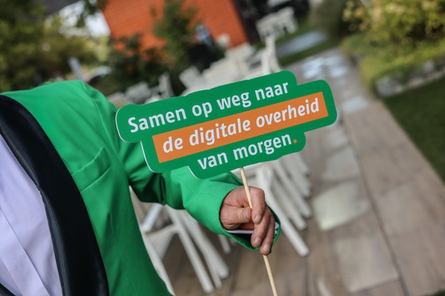

# GGM Toegepast: data as a service door Centric

Een aantal jaren geleden heeft Centric de transitie ingezet om haar software in de vorm van Software as a Service (SaaS) te leveren. Een van de vragen die we daar steevast bij kregen was “hoe kom ik dan bij mijn data?”. Een terechte vraag natuurlijk. De data is eigendom van de klant en die moet daarover, ook in SaaS, kunnen beschikken. Wij hebben hiervoor ons Dataplatform ontwikkeld waarbij alle relevante data door middel van API’s op basis van een standaardformaat aan klanten beschikbaar wordt gesteld.   

Aanvullend op deze beschikbaarstelling van de data willen wij onze klanten verdergaand ondersteunen in het gebruik van deze data. Dat doen we onder andere door de ontwikkeling van views en datamarts waarmee de data op een meer logische manier wordt ontsloten. Veel voorkomende query’s en samenvoegingen van data zijn hierbij al voorbereid. Vanzelfsprekend leveren wij hier bovenop ook datavisualisaties, dashboards, standaard rapportages en verdergaande data science oplossingen.   

De transformatie naar het Gemeentelijk Gegevensmodel (GGM) willen wij ook graag als aanvullende dienst aan onze klanten leveren. Wij constateren dat op dit moment veel gemeenten energie steken in het mappen op het GGM van data uit onze applicaties (en die van andere leveranciers) en zelf de transformatie van die data naar GGM inregelen. Daarbij wordt gelukkig gebruik gemaakt van mappings die al door andere gemeenten zijn opgezet, maar toch kost dit nog veel tijd. Voor onze SaaS-oplossingen willen wij de mogelijkheid bieden om deze transformatie door ons via het Centric Dataplatform uit te laten voeren. Dit biedt gemeenten de voordelen dat slechts eenmalig de inspanning nodig is om de mapping en de transformatie op te zetten, deze mapping en transformatie eenduidig is én dat bij toekomstige wijzigingen in onze datamodellen of GGM deze automatisch verwerkt worden. Als leverancier van de software weten wij natuurlijk het beste hoe onze datamodellen te vertalen naar het GGM.   

Met de trekkers van de GGM-community is gesproken over de mogelijkheid om al door gemeenten opgestelde mappings te delen, zodat wij deze voor onze applicaties kunnen beoordelen en voorzien van een stempel/vinkje en onder condities kunnen gebruiken binnen onze dienstverlening. Hier is enthousiast op gereageerd, wij zijn in afwachting van het vervolg hierop. Daarnaast stellen wij zelf mappings op voor onze applicaties waarvoor binnen de community nog geen mappings zijn gemaakt. Op dit moment werken wij aan de mapping voor Centric Financiën. Gemeenten die belangstelling hebben om de implementatie van het GGM in combinatie met onze oplossingen samen op te pakken roepen wij op om zich bij ons te melden.     

Ron Bartels,

Ron.Bartels@Centric.eu