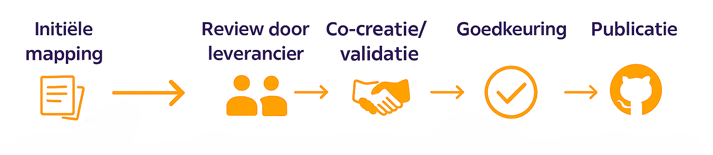

# Samenwerken aan het GGM

Het Gemeentelijk Gegevensmodel (GGM) is een gezamenlijke inspanning van gemeenten, leveranciers en de expertgroep. Met elkaar werken we aan het versterken, uitbreiden en toepasbaar maken van het model. Hier delen we de afspraken die we hanteren in de samenwerking. Of je nu een vraag hebt, wilt bijdragen aan de mappings, het GGM wilt toepassen, of een voorstel wilt doen voor uitbreiding/aanpassing: je weet straks precies hoe je het aan moet pakken.

## Waar staat wat

Het Gemeentelijk Gegevensmodel kent verschillende omgevingen waar informatie te vinden is. Op de [website](https://www.gemeentelijkgegevensmodel.nl/) vind je de praktische en technische documentatie over het Gemeentelijk Gegevensmodel. Op [GitHub](https://github.com/Gemeente-Delft/Gemeentelijk-Gegevensmodel/tree/master) staat het model, de verschillende releases en de [mappings](https://github.com/Gemeente-Delft/GGM-Mappings?tab=readme-ov-file). Op de [Community](https://kennisnetwerkdata.pleio.nl/groups/view/1e7df5c5-e537-46cd-9d09-de2ef29beef8/gemeentelijk-gegevensmodel-ggm) kan je vragen stellen, informatie delen en de samenwerking opzoeken. Als laatste kan je op de [Wie Wat Status](https://wiewatstatus.web.app/) lijst terugvinden welke gemeente al aan welke mapping aan het werk is en contact opnemen via de community om de mapping te ontvangen. 

## Afspraken voor samenwerking

We werken transparant, iteratief en op basis van co-creatie. Dit geldt zowel voor de proposals als de mappings. Proposals zijn wijzigings- of doorontwikkelvoorstellen voor het Gemeentelijk Gegevensmodel. Mappings zijn voor de vertaling van brondata naar het Gemeentelijk Gegevensmodel. 

### Proposal aanleveren

Heb je een wijzigings- of doorontwikkelpropositie voor het GGM?

1. Maak een voorstel via het [format](https://kennisnetwerkdata.pleio.nl/files/view/57d894ac-c7ea-42c0-9042-f81ab1af7607/format-proposal.docx):  
   `Bestanden/2. Doorontwikkeling GGM/format proposal.docx`
2. Controleer je voorstel met het [GGM Cookbook](cookbook/inleiding_en_uitgangspunten.md)
3. Plaats het voorstel in:  
   `Bestanden/2. Doorontwikkeling GGM/1. Proposals`
4. Meld dit via e-mail aan:  
   `mvdstoel@Delft.nl`
5. Review door de expertgroep, je wordt uitgenodigd om je proposal toe te lichten in de expertgroep-vergadering.
6. Na verwerking van feedback komt het voorstel onder **Openbare Consultatie**
7. Hier kan de community feedback geven op het proposal
8. Na verwerking van alle feedback wordt het voorstel opgenomen in een release

### Proposal reviewen

Proposals onder Openbare Consultatie en in de map `Bestanden/2. Doorontwikkeling GGM/1. Proposals`

- Proposals onder consultatie staan in:  
  `Bestanden/2. Doorontwikkeling GGM/1. Proposals`
- Download het voorstel en voeg feedback toe
- Sla het feedbackdocument op als:  
  `[naam proposal]_feedback[gemeentenaam].docx`
- Plaats het document in dezelfde map als het voorstel

### Mappings co-creatieproces 

Het co-creatieproces bestaat uit de volgende stappen:

1. **Initiële mapping**  
   Een eerste versie van de mapping wordt opgesteld door een initiatiefnemer, gebaseerd op beschikbare gegevens en kennis.

2. **Review door leverancier**  
   De betrokken leverancier ontvangt de initiële mapping en beoordeelt deze op juistheid en volledigheid.

3. **Co-creatie/validatie**  
   In samenwerking met de leverancier worden eventuele aanpassingen doorgevoerd en de mapping gevalideerd.

4. **Goedkeuring**  
   Na overeenstemming tussen initiatiefnemer en leverancier wordt de mapping formeel goedgekeurd.

5. **Publicatie**  
   De definitieve mapping wordt opgenomen in de repository op github en beschikbaar gesteld voor gebruik door de community.

### Mappings plaatsen op GitHub

Controleer eerst of er voor de desbetreffende applicatie en domein al een mapping bestaat. Als deze al bestaat, gebruik dit als uitgangspunt zodat er één mapping per applicatie en domein is. 

- We gebruiken GitHub als centrale plek voor [mappings](https://github.com/Gemeente-Delft/GGM-Mappings?tab=readme-ov-file) 
- Fork en clone repository
    - Maak een fork van deze repository en clone deze naar je lokale omgeving.
- Maak een branch voor de nieuwe mapping
    - Creëer een nieuwe branch met een duidelijke naam, bijvoorbeeld `feature/leveranciersysteem-mapping`.
- Voeg mapping toe in juiste map
    - Plaats de mapping in de juiste directory structuur: `mappings/GGM-Domein/Deeldomein/Leveranciersysteem/`
    - Voeg hier de mapping toe als **mapping.xlsx** en een begeleidende **README.md met uitleg**. In de templates directory vind je voor beide een template-bestand.
- Commit met duidelijke boodschap
    - Commit je wijzigingen met een heldere en beschrijvende boodschap.
- Push naar eigen fork en open een Pull Request
    - Push je branch naar je fork en open een Pull Request richting de hoofdrepository.
- Beschrijf leverancier, systeem, versie, context
    - Geef in de Pull Request een uitgebreide beschrijving van de mapping, inclusief leverancier, systeem, versie en relevante context.
- Community + leverancier reviewen en keuren goed
    - De community en de leverancier zullen de Pull Request beoordelen en feedback geven. Pas indien nodig aan.
- Na goedkeuring merge en publicatie
    - Na goedkeuring wordt de Pull Request gemerged en wordt de mapping gepubliceerd.

## Releases

Om het Gemeentelijk Gegevensmodel beheersbaar en transparant te houden, werken we met een releaseproces.

### Releasecyclus

- **Periodieke releases**  
  Updates aan het GGM worden gebundeld en periodiek gepubliceerd, inclusief toelichting.

- **Tussentijdse updates**  
  Updates op de documentatie kunnen tussentijds worden toegevoegd.

- **Versiebeheer**  
  Elke release krijgt een versienummer en wordt opgenomen in het versiebeheer.

### Communicatie

Releases worden aangekondigd via de GGM-community, gemeld op LinkedIn en via een release mail. Hierin wordt toegelicht wat er veranderd is ten opzichte van de vorige versie.