# Presentatie: GGM-Stap-voor-stap-bron-naar-dashboard

## GGM Startersgids

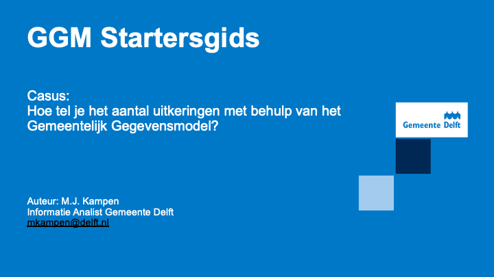

## GGM Startersgids

## 1. De Informatievraag

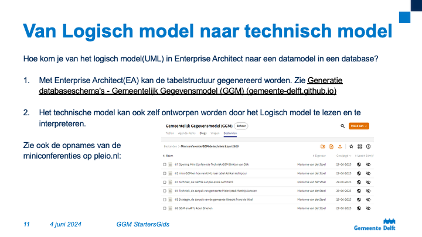

## Waar beginnen we?

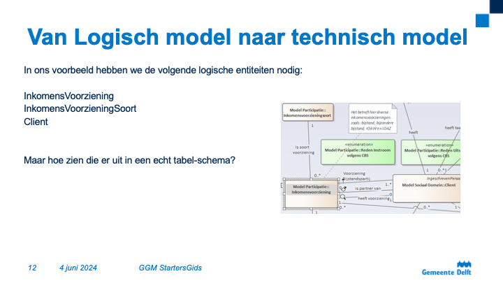

## Definitie

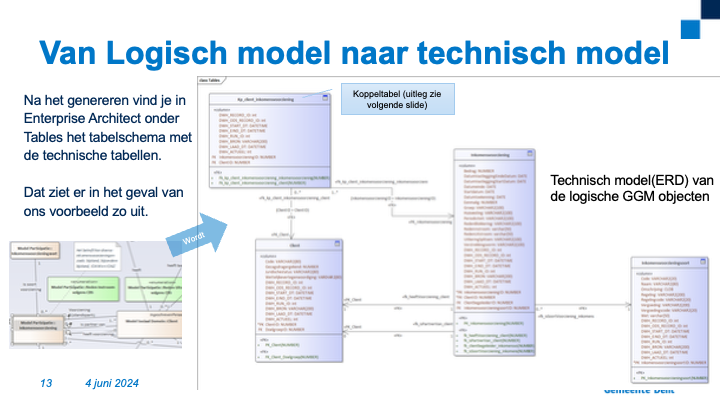

## Attributen van een InkomensVoorziening

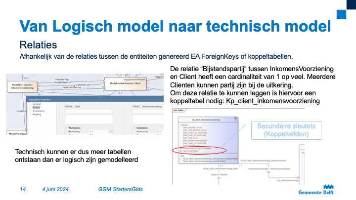

## De bron

## Wat is er nodig om de vraag te beantwoorden?

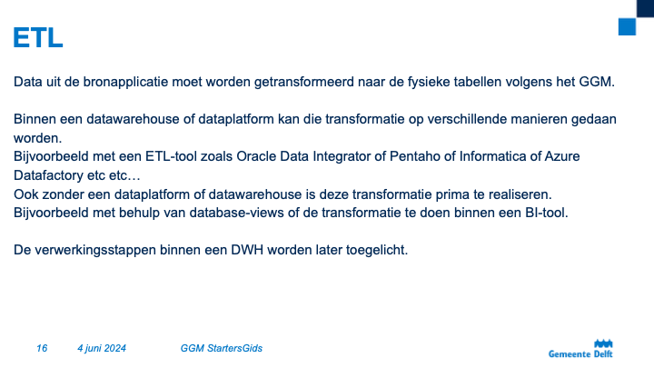

## Waar vind ik dat in de Bron?

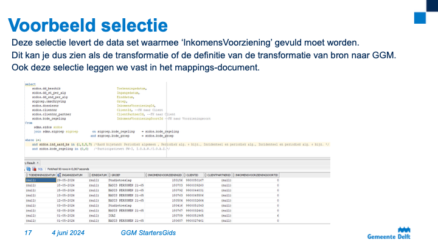

## GGM StartersGids

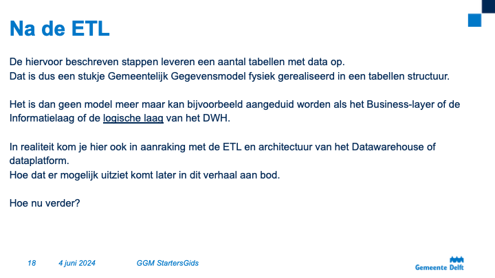

## Van Logisch model naar technisch model

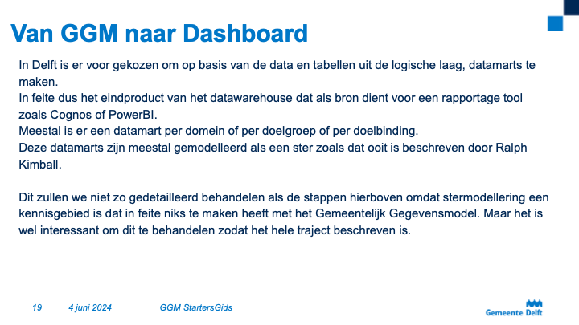

## Van Logisch model naar technisch model

## Van Logisch model naar technisch model

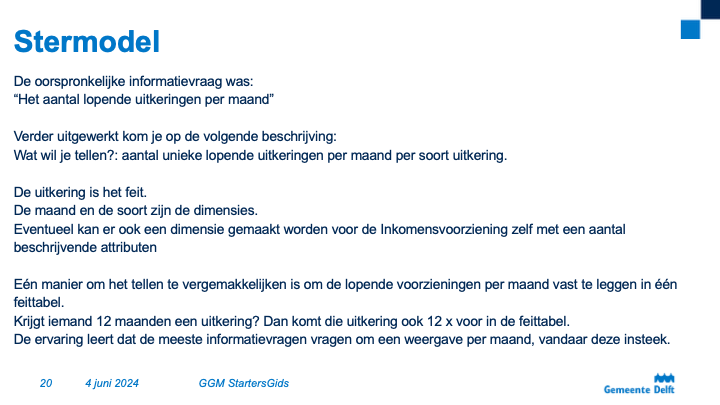

## Van Logisch model naar technisch model

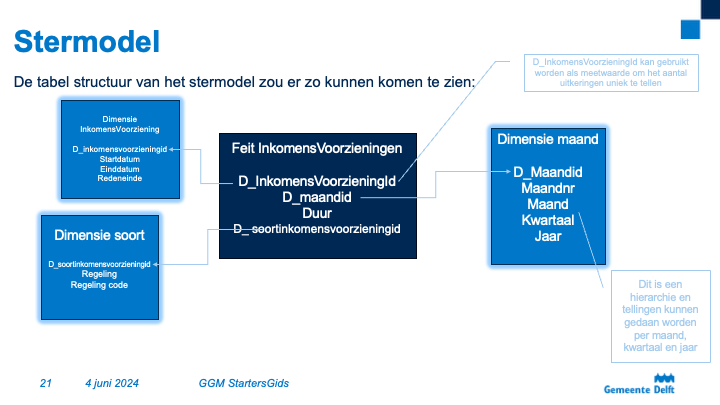

## Mappings van bron naar GGM

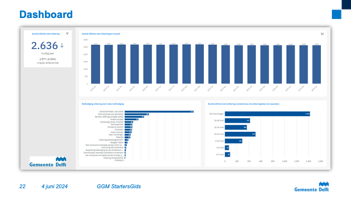

## Data uit de bronapplicatie moet worden getransformeerd naar de fysieke tabellen volgens het GGM.

## Binnen een datawarehouse of dataplatform kan die transformatie op verschillende manieren gedaan worden.

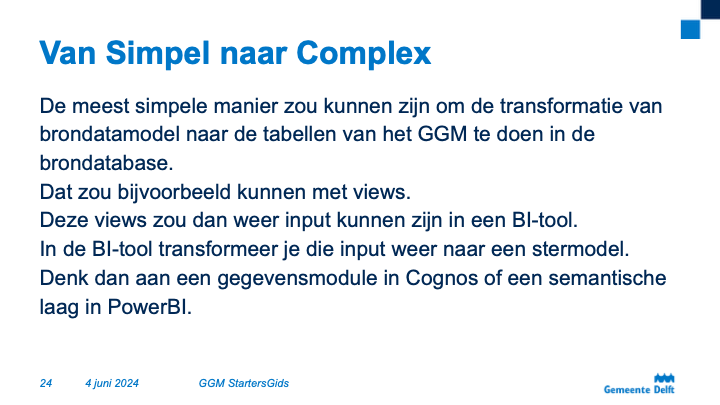

## Bijvoorbeeld met een ETL-tool zoals Oracle Data Integrator of Pentaho of Informatica of Azure Datafactory etc etc…

## Ook zonder een dataplatform of datawarehouse is deze transformatie prima te realiseren.

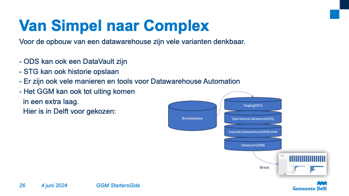

## Bijvoorbeeld met behulp van database-views of de transformatie te doen binnen een BI-tool.

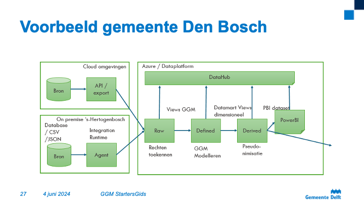

## De verwerkingsstappen binnen een DWH worden later toegelicht.

## Deze selectie levert de data set waarmee ‘InkomensVoorziening’ gevuld moet worden.Dit kan je dus zien als de transformatie of de definitie van de transformatie van bron naar GGM.

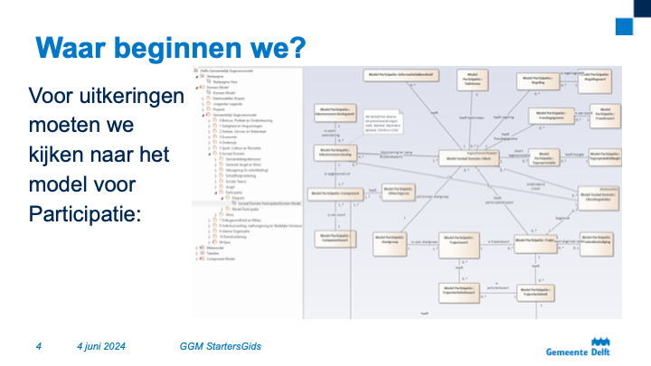

## Ook deze selectie leggen we vast in het mappings-document.

## De hiervoor beschreven stappen leveren een aantal tabellen met data op.

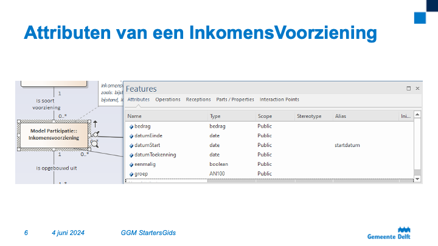

## Dat is dus een stukje Gemeentelijk Gegevensmodel fysiek gerealiseerd in een tabellen structuur.

## Het is dan geen model meer maar kan bijvoorbeeld aangeduid worden als het Business-layer of de Informatielaag of de logische laag van het DWH.

## In realiteit kom je hier ook in aanraking met de ETL en architectuur van het Datawarehouse of dataplatform.

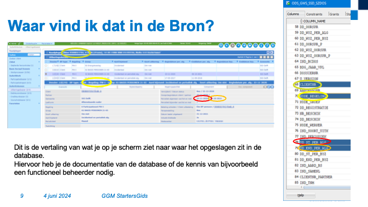
