# Presentatie: GGM-Startersgids-Totale-Presentatie

## MINI CONFERENTIE

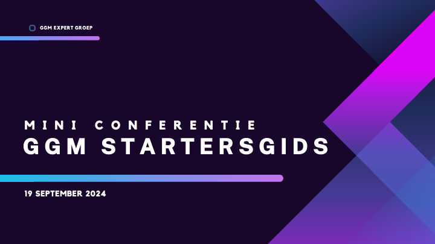

## OPENING

## Het GGM en de startersgids

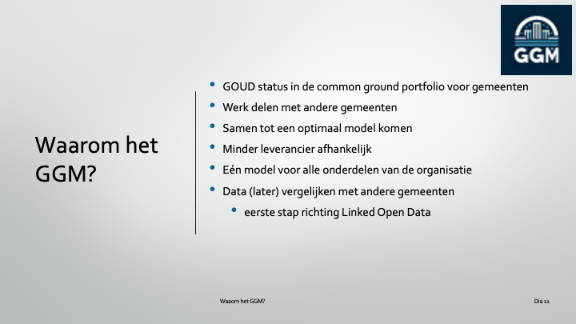

## Inhoud

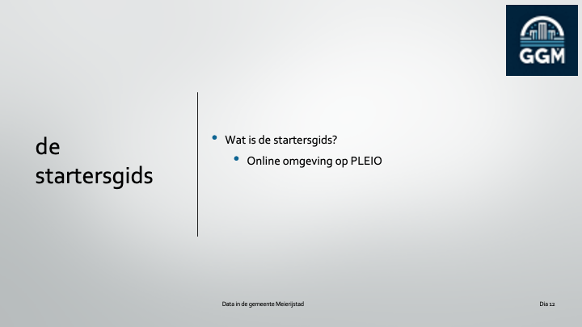

## Wat is het ggm?

## Waarom het GGM?

## Waarom het GGM?

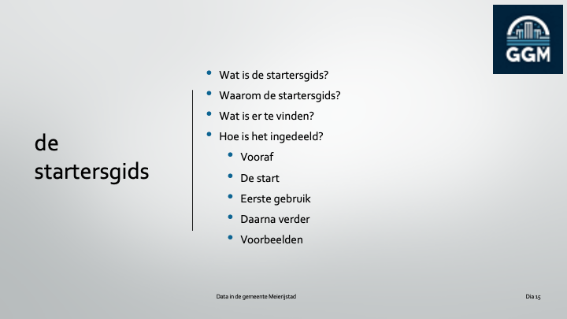

## Waarom het GGM?

## Waarom het GGM?

## Waarom het GGM?

## Waarom het GGM?

## de startersgids

## de startersgids

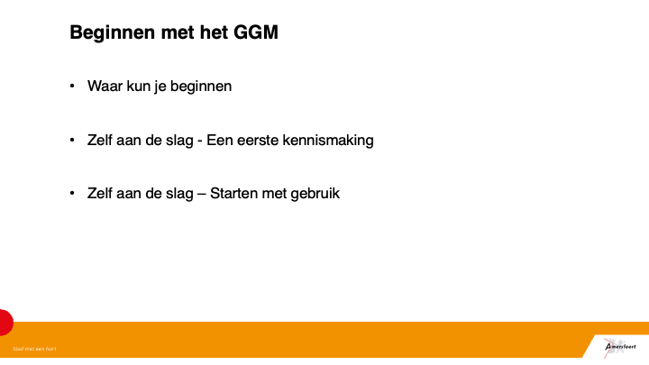

## de startersgids

## de startersgids

## de startersgids

## Natalie Pollock

## npollock@meierijstad.nl

## +31 (413) 381 188

## Dataspecialist

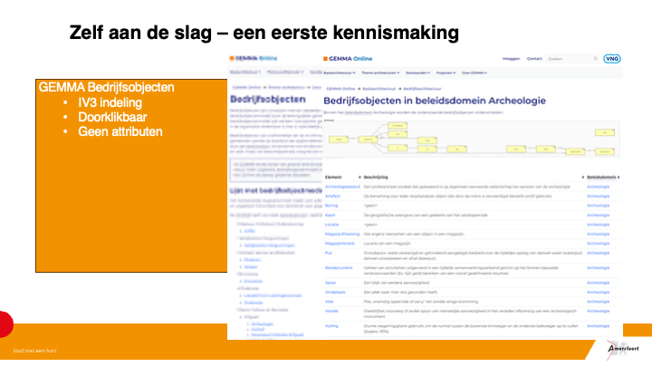

## Beginnen met het GGM

## Even voorstellen

## Beginnen met het GGM

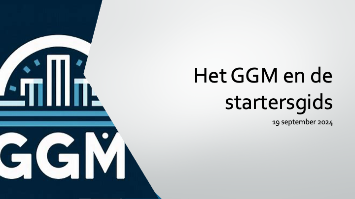

## Waar kun je beginnen

## Waar kun je beginnen

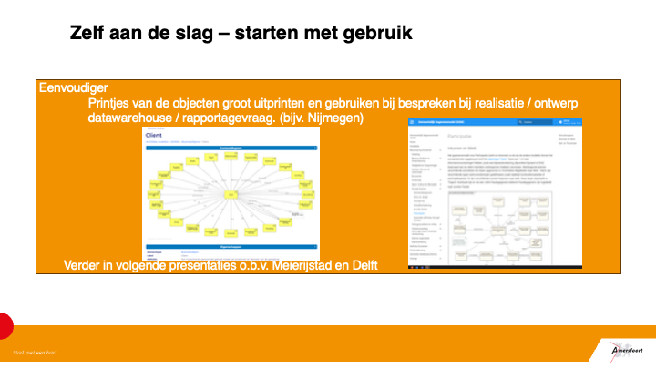

## Waar kun je beginnen

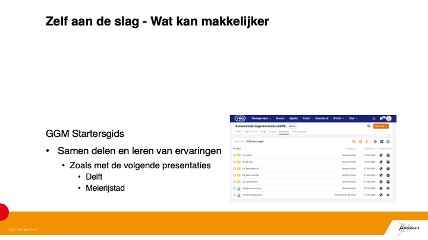

## Waar kun je beginnen – GGM Startersgids !

## Zelf aan de slag

## Zelf aan de slag – een eerste kennismaking

## Zelf aan de slag – een eerste kennismaking

## Zelf aan de slag – een eerste kennismaking

## Zelf aan de slag – starten met gebruik

## Zelf aan de slag – starten met gebruik

## Zelf aan de slag – starten met gebruik

## Zelf aan de slag - Wat kan makkelijker

## Bedankt voor uw aandacht.

## GGM in het begin

## Inhoud

## Beginsituatie meierijstad

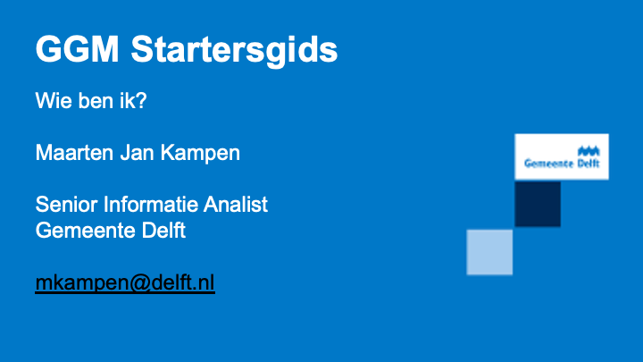

## Introductie Meierijstad & GGM

## Introductie meierijstad & ggm Implementatie GGM

## Aanpak & partnerschap

## Flexibiliteit en aanpassingen

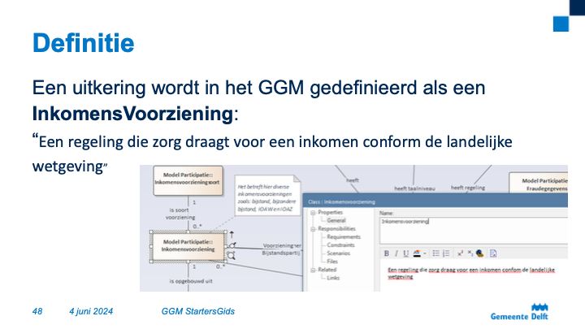

## Conclusie

## PAUZE

## GGM Startersgids

## GGM Startersgids

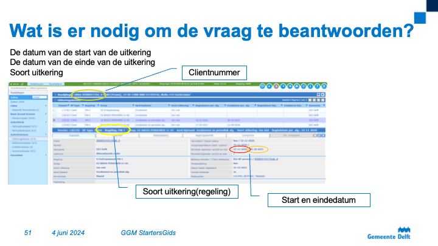

## GGM Startersgids

## 1. De Informatievraag

## Waar beginnen we?

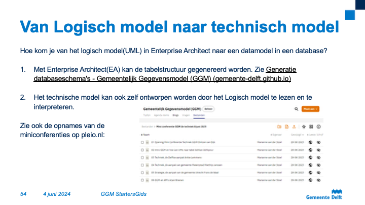

## Definitie

## Attributen van een InkomensVoorziening

## De bron

## Wat is er nodig om de vraag te beantwoorden?

## Waar vind ik dat in de Bron?

## GGM StartersGids

## Van Logisch model naar technisch model

## Van Logisch model naar technisch model

## Van Logisch model naar technisch model

## Van Logisch model naar technisch model

## Mappings van bron naar GGM

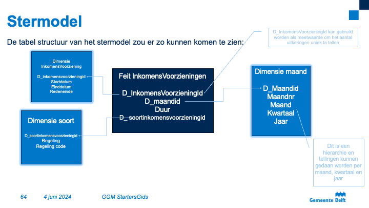

## Data uit de bronapplicatie moet worden getransformeerd naar de fysieke tabellen volgens het GGM.

## Binnen een datawarehouse of dataplatform kan die transformatie op verschillende manieren gedaan worden.

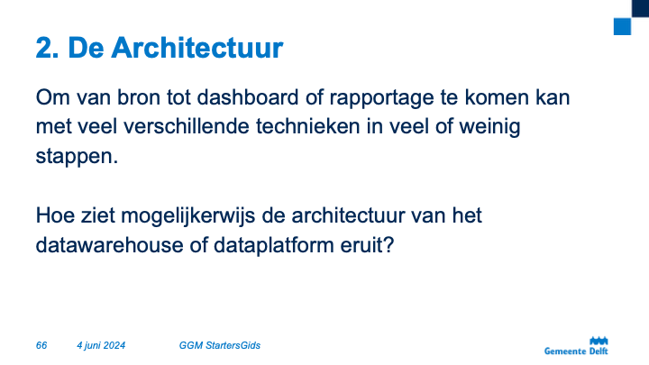

## Bijvoorbeeld met een ETL-tool zoals Oracle Data Integrator of Pentaho of Informatica of Azure Datafactory etc etc…

## Ook zonder een dataplatform of datawarehouse is deze transformatie prima te realiseren.

## Bijvoorbeeld met behulp van database-views of de transformatie te doen binnen een BI-tool.

## De verwerkingsstappen binnen een DWH worden later toegelicht.

## Deze selectie levert de data set waarmee ‘InkomensVoorziening’ gevuld moet worden.Dit kan je dus zien als de transformatie of de definitie van de transformatie van bron naar GGM.

## Ook deze selectie leggen we vast in het mappings-document.

## De hiervoor beschreven stappen leveren een aantal tabellen met data op.

## Dat is dus een stukje Gemeentelijk Gegevensmodel fysiek gerealiseerd in een tabellen structuur.

## Het is dan geen model meer maar kan bijvoorbeeld aangeduid worden als het Business-layer of de Informatielaag of de logische laag van het DWH.

## In realiteit kom je hier ook in aanraking met de ETL en architectuur van het Datawarehouse of dataplatform.

## Hoe dat er mogelijk uitziet komt later in dit verhaal aan bod.

## Hoe nu verder?

## In Delft is er voor gekozen om op basis van de data en tabellen uit de logische laag, datamarts te maken.In feite dus het eindproduct van het datawarehouse dat als bron dient voor een rapportage tool zoals Cognos of PowerBI.Meestal is er een datamart per domein of per doelgroep of per doelbinding.

## Deze datamarts zijn meestal gemodelleerd als een ster zoals dat ooit is beschreven door Ralph Kimball.

## Dit zullen we niet zo gedetailleerd behandelen als de stappen hierboven omdat stermodellering een kennisgebied is dat in feite niks te maken heeft met het Gemeentelijk Gegevensmodel. Maar het is wel interessant om dit te behandelen zodat het hele traject beschreven is.

## De oorspronkelijke informatievraag was:

## “Het aantal lopende uitkeringen per maand”

## Verder uitgewerkt kom je op de volgende beschrijving:

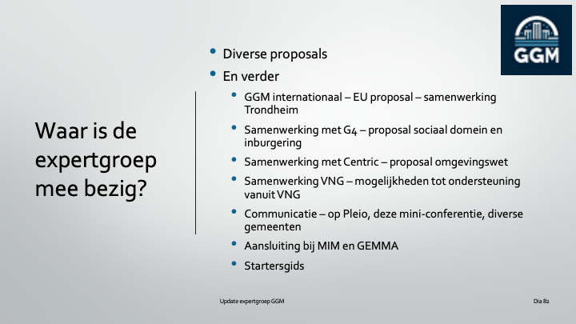

## Wat wil je tellen?: aantal unieke lopende uitkeringen per maand per soort uitkering.

## De uitkering is het feit.

## De maand en de soort zijn de dimensies.Eventueel kan er ook een dimensie gemaakt worden voor de Inkomensvoorziening zelf met een aantal beschrijvende attributen

