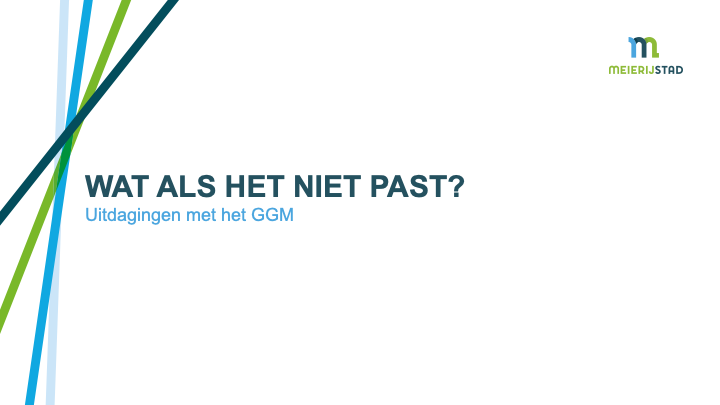
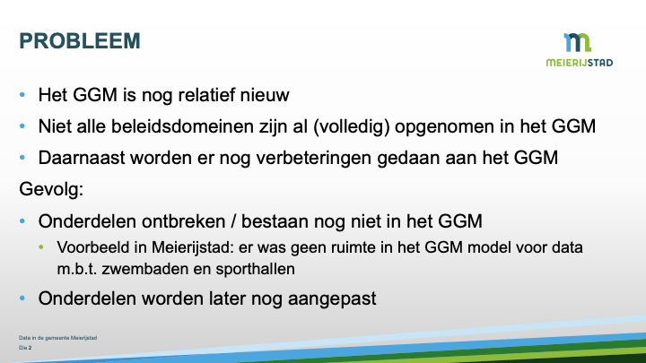
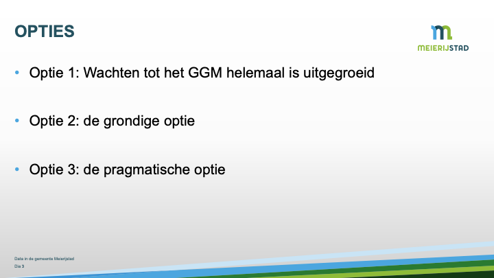
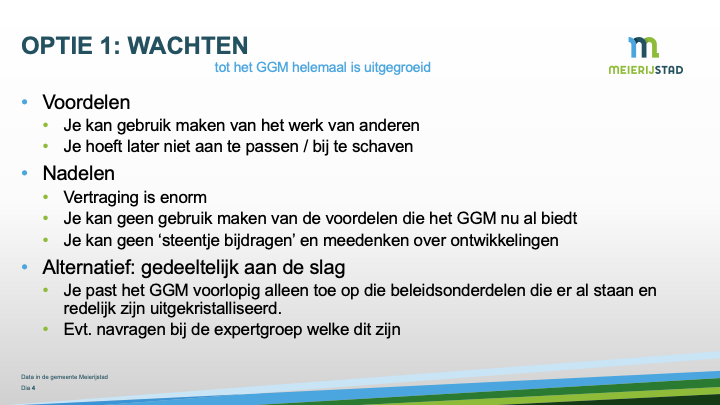
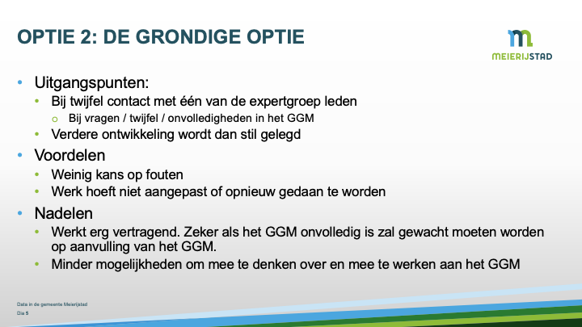
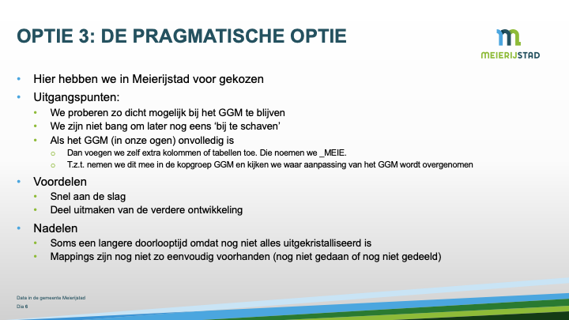
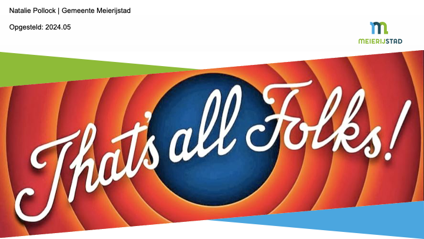

# Presentatie: Wat-als-het-niet-past

## Wat als het niet past?

## probleem

## opties

## Optie 1: Wachten

## Optie 2: de grondige optie

## Optie 3: de pragmatische optie

## Natalie Pollock | Gemeente Meierijstad

