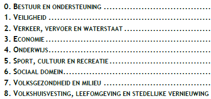

1. *Wat heeft het GGM met Iv3 te maken?*

1. *Wat is Iv3?*

Het GGM omvat alle beleidsterreinen die onder de verantwoordelijkheid van de gemeente vallen. Dit ongeacht de organisatorische inrichting, zoals de afdelingen die de bijbehorende taken uitvoeren en uitbesteding aan derde partijen. Deze beleidsterreinen zijn afgeleid van de [IV3-taakvelden](https://www.rijksoverheid.nl/onderwerpen/financien-gemeenten-en-provincies/uitwisseling-financiele-gegevens-met-sisa-en-iv3/informatie-voor-derden-iv3).[^1]

# RIJKSOVERHEID

Iv3 (Informatie voor Derden) is een informatiesysteem. Hierin staat welke financiële informatie de gemeente, provincie en gemeenschappelijke regeling moet verstrekken. En op welke manier. De Iv3 taakvelden (in 2025) zijn:

Lees meer over het Iv3 op de site van de rijksoverheid:

[Informatie voor Derden (Iv3) | Financiën gemeenten en provincies | Rijksoverheid.nl](https://www.rijksoverheid.nl/onderwerpen/financien-gemeenten-en-provincies/uitwisseling-financiele-gegevens-met-sisa-en-iv3/informatie-voor-derden-iv3)

# STATLINE

Het CBS stelt de onbewerkte gegevens uit de Iv3-rapportages (Informatie voor derden) van decentrale overheden beschikbaar, vanaf verslagjaar 2010. Deze informatie is gratis en gemakkelijk te downloaden. De Iv3-rapportages betreffen financiële gegevens van gemeenten, gemeenschappelijke regelingen, provincies en waterschappen voor begrotingen en kwartaal- en jaarrekeningen.

Zie hiervoor: [StatLine (cbs.nl)](https://iv3statline.cbs.nl/#/IV3/nl/)

\[^1\]: [Gemeentelijk Gegevensmodel (GGM) (gemeente-delft.github.io)](https://gemeente-delft.github.io/Gemeentelijk-Gegevensmodel/)
