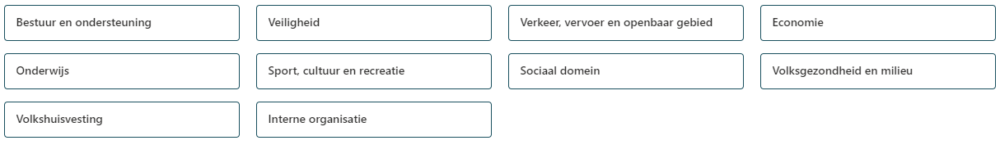
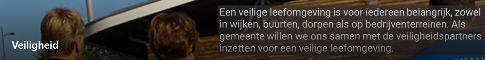
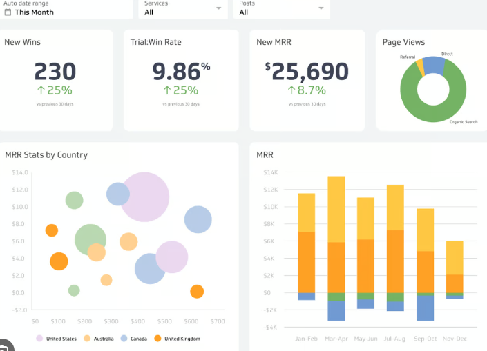
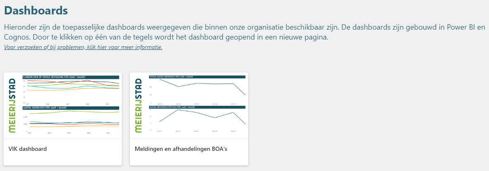
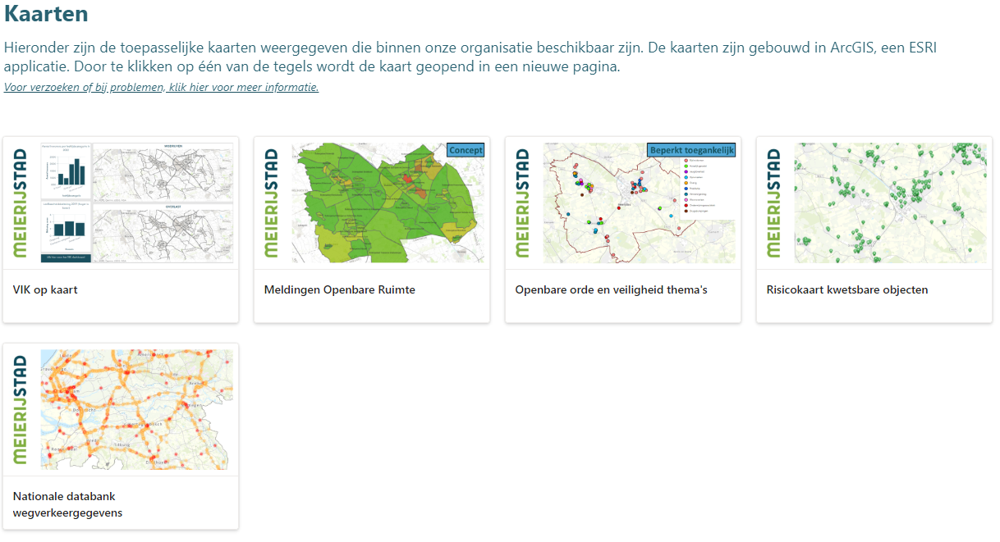
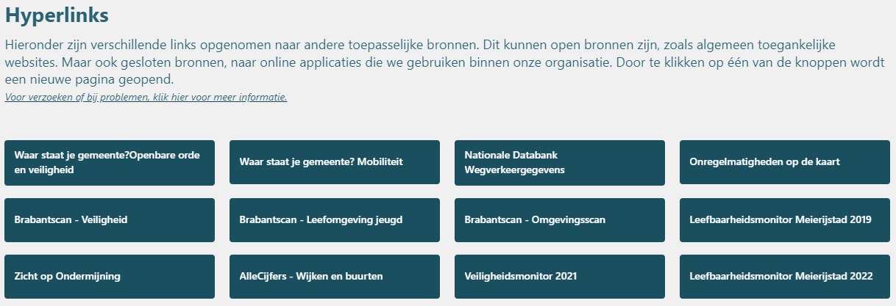

1. *Een voorbeeld – ter inspiratie*

1. *Van de gemeente Meierijstad*

Als je nog niet weet wat Iv3 is of wat dit te maken heeft met het GGM, lees dan eerst het document Iv3.

# PORTAAL DGW

Binnen de gemeente Meierijstad hebben we een ‘Portaal datagedreven werken’. Dit betreft een sharepoint omgeving en is gebouwd op standaard sharepoint functionaliteiten.

Het doel van het portaal is om alle verschillende informatieproducten op één centrale plaats beschikbaar te stellen aan onze organisatie. Dit betreffen met name dashboards, kaarten en linkjes naar openbare websites. Door op deze manier te werken zijn alle informatieproducten voor iedereen te vinden en zijn we niet afhankelijk van de kennis die ‘leeft’ bij een specifieke collega. (Welke kennis mogelijk verloren gaat bij een vertrek.) Niet alle informatie is voor iedereen toegankelijk, maar doordat mensen in elk geval zien dat er (bijv.) een dashboard is, kunnen zij afwegen of dit voor hen van belang is en een verzoek om toegang bij ons team indienen.

# Iv3

Voor de indeling van ons portaal DGW hebben we aansluiting gezocht bij de Iv3 taakvelden. We wilden namelijk een standaard indeling die voor langere tijd houdbaar zou zijn. De Iv3 taakvelden zijn redelijk statisch. Daarnaast sluit het uiteraard ook aan bij het GGM, wat dit voor ons een ‘win-win’ optie maakte.

De categorieën als te vinden op ons portaal zijn dan ook:

# IN BEELD

Hieronder de nodige plaatjes om een beeld te schetsen van hoe ons portaal eruit ziet. Een en ander is slechts bedoeld ter inspiratie. Ons portaal is altijd in ontwikkeling. We proberen oude / verouderde informatie te verwijderen en nemen nieuwe informatie op het portaal op.

Ons portaal bestaat d.d. schrijven ruim 2 jaar.

Elke pagina bestaat uit 4 of 5 onderdelen. Dit zijn (in volgorde van boven naar beneden op de pagina:

1. Een koptekst. Dit is slechts voor de aankleding. :

2. Een dashboard dat geïntegreerd is in de pagina. Vanuit privacy oogpunt laat ik een echt plaatje even achterwege. Maar bij ons betreft dit een Power BI dashboard dat is geïntegreerd en waarin dus direct informatie zichtbaar is.

Dit onderdeel komt niet op elke pagina voor. Alle andere onderdelen wel.

3. Eén of meerdere dashboards. Ons portal is nog groeiende. Helaas is er (in elk geval ten tijde van dit schrijven) nog één pagina zonder een enkel dashboard, maar er zijn ook pagina’s met 12 dashboards. Al is kwaliteit uiteraard belangrijker dan kwantiteit.

4. Eén of meerdere kaarten. Dit zijn kaarten die die met het thema samenhangen. Zoals je kan zien hebben we kaarten (en dashboards) die beperkt toegankelijk zijn of die nog in concept zijn een labeltje meegegeven (blauw, rechter bovenhoek) zodat dit voor iedereen duidelijk is.

5. Eén of meerdere hyperlinks naar (veelal) openbare bronnen op het internet.

