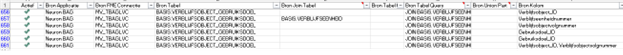
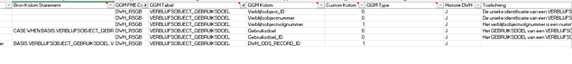
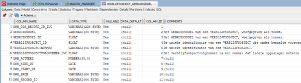

# GGM x Land van Cuijk: Modelleren zonder Enterprise Architect

**Door:** Inge van Creij-Maas, Data Engineer gemeente Land van Cuijk  
**In samenwerking met:** Michiel Nusselder, voormalig Esri Technology Specialist Tensing

## Inleiding: Praktische implementatie GGM bij gemeente Land van Cuijk

In 2022 is de gemeente Land van Cuijk ontstaan als gevolg van een herindeling van vijf voormalige gemeenten. Binnen deze nieuwe gemeentelijke organisatie is een cluster *Datagedreven Werken* opgericht, met als doel het ondersteunen van meer objectieve besluitvorming. Hiervoor was het essentieel om de gegevenshuishouding op orde te brengen. Als beste optie werd gekozen voor de implementatie van een datawarehouse (DWH) gebaseerd op het Gemeentelijk GegevensModel (GGM), vanwege de mogelijkheden tot samenwerking en kennisdeling met andere gemeenten.

Na de aanschaf van Enterprise Architect hebben wij aanvankelijk geprobeerd het complete GGM te vertalen naar fysieke tabellen door binnen Enterprise Architect de Data Definition Language (DDL) te genereren. Dit leidde echter tot diverse foutmeldingen, onder andere met betrekking tot naamgevingsconflicten. Tevens bleek dat er inconsistenties waren in het gebruik van kolomnamen; soms werden de werkelijke kolomnamen gehanteerd, terwijl op andere momenten synoniemen werden toegepast.

De genoemde foutmeldingen met betrekking tot kolomnamen waren niet de enige correcties die noodzakelijk waren. Ook de structuur die aan de kolommen werd toegekend, bleek niet altijd correct te zijn. Zo was een veld bijvoorbeeld te kort gedefinieerd of werden onjuiste datatypen toegewezen.

Hoewel het mogelijk was om deze DDL handmatig te corrigeren, zou dit een tijdrovend proces zijn geweest. Enerzijds vanwege de vele correcties die moesten worden doorgevoerd in de door Enterprise Architect gegenereerde DDL om de foutmeldingen te verhelpen. Anderzijds is het GGM niet bedoeld om 1 op 1 te kopiëren; het is bedoeld als raamwerk, waarin gemeenten zelf de accenten moeten aanbrengen die relevant zijn voor hun specifieke situatie. Onderwerpen die voor onze gemeente van belang zijn, zijn mogelijk nog niet volledig uitgewerkt in het GGM. Verder zitten er onderdelen in verwerkt die voor ons niet van toepassing zijn en waarvan het naar onze mening weinig meerwaarde had om deze over te nemen enkel omwille van volledigheid.

In feite zouden wij dus twee handmatige bewerkingsrondes moeten uitvoeren: allereerst het corrigeren van de DDL en vervolgens het uitbreiden ervan met relevante onderwerpen voor de gemeente Land van Cuijk, en het verwijderen van niet-relevante onderdelen. Hierdoor werd de toegevoegde waarde en de tijdwinst ten opzichte van het zelf ontwerpen van een DDL-structuur beperkt.

Na een zorgvuldige interne afweging is daarom besloten af te zien van het gebruik van de DDL vanuit Enterprise Architect en in plaats daarvan een alternatieve aanpak te hanteren, waarbij de DDL-structuur buiten Enterprise Architect zelf wordt opgebouwd.

## Kernprincipes

Tijdens de afweging hebben we een aantal punten van aandacht benoemd, die wij in ons proces wilden verwerken en die bijgedragen hebben aan het besluit om zelf een DDL-structuur op te zetten. Dat zijn de volgende:

### DDL op basis van de Mappings
Uit ervaringen van andere gemeenten die reeds met het GGM waren begonnen, begrepen we dat vaak eerst de tabellen worden aangemaakt en gevuld in het DWH op basis van een aangepaste DDL, waarna de mappings achteraf worden bijgewerkt. Hoewel deze werkwijze begrijpelijk is, besloten wij dat het minder foutgevoelig en ook efficiënter zou zijn om het uitwerken van de mappings te combineren met het opstellen van de DDL. Om die reden is ervoor gekozen het mappingsdocument als basis te gebruiken voor de DDL; zo wisten we zeker dat de mappings en het DWH altijd met elkaar in overeenstemming zouden zijn.

### Betrokkenheid Applicatiebeheerders
Voor onze bedrijfskritieke applicaties beschikt de gemeente Land van Cuijk over toegewijde applicatiebeheerders. In de praktijk zijn zij vaak de inhoudelijke kennishouders met betrekking tot de data in de applicaties. Zij kunnen ons onder andere vertellen welke gegevens er wel of niet in de applicatie worden vastgelegd en hoe we deze op de juiste manier kunnen interpreteren.

Om deze reden was het van belang dat de koppeling tussen bronkolommen en DWH-kolommen voor de applicatiebeheerders inzichtelijk gemaakt kon worden. Tevens wilden wij transparant maken hoe wij de data inhoudelijk interpreteerden, zodat zij suggesties en correcties konden aangeven wanneer zij dat wilden.

### Herbruikbaar en Volledig Zelfstandig Beheer
De ervaring is dat dergelijke projecten vaak door externe partijen worden opgepakt. Hier is niets mis mee, zolang er maar een bewuste afweging wordt gemaakt.

In ons geval is ervoor gekozen om de technische implementatie van het proces door een externe partner te laten verzorgen, terwijl de inhoudelijke kennis intern wordt opgebouwd. Een vereiste hierbij was dat het proces flexibel genoeg werd om herhaaldelijk toegepast te worden voor de verschillende bronapplicaties. Hiermee werd voorkomen dat er een afhankelijkheid zou ontstaan van een externe partner en was er ook een duidelijk eindpunt voor de samenwerking. Tijdens de inrichting heeft de gemeente inhoudelijke beslissingen genomen en zodra het technische gedeelte van het proces gereed was, vond de volledige overdracht naar de gemeente Land van Cuijk plaats. Nieuwe bronapplicaties voegen wij dus zelf toe aan het bestaande proces, zodat de inhoudelijke kennis over deze bronnen binnen de organisatie geborgd blijft.

## Globale Aanpak: van Datamodel tot Fysieke tabel

Op basis van deze principes hebben wij een DDL-implementatieproces ontwikkeld dat gebruikmaakt van eigen tooling. Dit proces is opgebouwd rondom drie centrale componenten:

- **Microsoft Excel**: Voor het eenvoudig beheren en aanpassen van de mappings en de bijbehorende SQL-clauses.  
- **Oracle (on premise)**: Ingezet als centrale database voor het datawarehouse (DWH).  
- **FME**: Gebruikt als ETL-tool voor het overbrengen van data naar het DWH, alsmede voor het genereren van het uiteindelijke SQL-statement op basis van het Excel-bestand met de mappings.  

### Excel: beheer van mappings en bijbehorende SQL-clauses
Onderstaand is een fragment zichtbaar uit het mappingsdocument, waarin is aangegeven hoe de brontabellen van de BAG worden omgezet naar de DWH tabel `VERBLIJFSOBJECT_GEBRUIKSDOEL`.

In dit mappings bestand zijn een aantal extra kolommen opgenomen ten opzichte van de mappings template op de Pleio omgeving van de VNG. Deze zijn met name bedoeld om het SQL statement goed op te kunnen bouwen met FME. Voorbeelden van deze extra kolommen zijn; bron FME connectie, de Bron Tabel Query (waarin de JOIN en de WHERE clausule van het SQL statement worden geplaatst indien aanwezig) en Bron Kolom Statement (met kolom specifieke statements, zoals CASE WHEN statements).

Daarnaast zijn er kolommen toegevoegd waarmee wordt aangegeven of een kolom reeds in het GGM voorkomt, of dat het een voor de gemeente Land van Cuijk specifieke *Custom* kolom betreft. Tevens is een kolom toegevoegd waarmee aangeduid wordt of er historische gegevens moeten worden opgebouwd in het DWH, en een kolom waar de inhoudelijke toelichting op de betreffende bronkolom wordt vastgelegd.

### FME & Oracle: Aanmaken Materialized View
Na het vullen van de mappings wordt een kopie van dit Excel bestand weggeschreven naar Oracle. De Oracle tabel dient als input voor FME, waarmee het benodigde SQL-statement wordt opgebouwd. Dit resulteert uiteindelijk in een zogenoemde Materialized View (MV) in Oracle. Een MV is vergelijkbaar met een reguliere View, met als belangrijk verschil dat een MV fysieke data bevat en daardoor buiten kantooruren kan worden opgebouwd. De Materialized View wordt iedere nacht volledig ververst.

Wanneer een bron een interne Oracle database is, wordt deze Materialized View opgebouwd in de database van de betreffende vakapplicatie. Op deze locatie hebben applicatiebeheerders ook inzage in de MV. Zowel de toelichting als de achterliggende bronkolommen zijn inzichtelijk gemaakt via de comments. De applicatiebeheerders kunnen deze comments en ook de achterliggende data inzien door middel van een leesaccount.

> *NB Als de bron extern is, wordt de data eerst in een aparte user in Oracle weggeschreven en binnen deze user de MV samengesteld, de applicatiebeheerder ontvangt hierop dezelfde leesrechten.*

### FME & Oracle: Aanmaken en vullen/uitbreiden DWH tabel
Nadat de Materialized View is aangemaakt in de brondatabase, wordt deze door FME gebruikt als uitgangspunt voor de opbouw van de DWH-tabel. De structuur van deze tabel is in grote lijnen gelijk aan die van de Materialized View, maar er worden een aantal DWH-specifieke kolommen toegevoegd. Deze extra kolommen zijn toegevoegd om de opbouw van historische gegevens in het datawarehouse te faciliteren (zoals startdatum, einddatum en een aanduiding of een record nog actueel is), evenals om de Record IDs van zowel het datawarehouse als de oorspronkelijke bron vast te leggen.

Vanaf het moment dat de DWH tabel is aangemaakt, wordt de historie opgebouwd. Dat gebeurt door middel van een FME script dat elke nacht draait en per bronrecord-ID de hashwaarde van alle kolommen berekent. Deze hashwaarde wordt vervolgens vergeleken met de hashwaarde van het actuele record in het DWH. Indien deze waarden van elkaar verschillen, wordt het bestaande record afgesloten en een nieuw record aangemaakt

Een meer specifieke beschrijving van de datawarehouse processen is terug te vinden in bijlagen 1 en 2.

## Conclusie

De gemeente Land van Cuijk heeft gekozen voor een proces waarbij het datawarehouse (DWH) wordt opgebouwd en uitgebreid zonder gebruik te maken van de door Enterprise Architect gegenereerde DDL. In plaats daarvan wordt de DDL door FME gegenereerd op basis van een zelf ontwikkeld mappingsdocument. Op deze wijze wordt geborgd dat het DWH en de mappings altijd met elkaar in overeenstemming zijn en dat het proces voldoende flexibel is om eenvoudig te kunnen worden toegepast op nieuwe bronapplicaties. Hierdoor kan het beheer, onderhoud en de uitbreiding van het DWH volledig door de gemeente zelf worden uitgevoerd.

Het resultaat van deze DDL is een Materialized View die tevens door de applicaties kan worden geraadpleegd, zodat zij waar nodig inhoudelijke aanvullingen en correcties kunnen doorgeven. Deze MV dient als uitgangspunt voor de DWH tabel, die dezelfde kolommen bevat als de MV en is aangevuld met DWH-specifieke kolommen. De DWH tabel wordt elke nacht bijgewerkt waarbij door middel van hashing wordt gekeken of de data in de bronrecord is veranderd ten opzichte van de data in de DWH record; in dat geval wordt het oude record afgesloten en een nieuwe aangemaakt.

## Bijlage 1: Basisproces datawarehouse ontsluiten van brondata 

Hieronder wordt het proces toegelicht dat wordt doorlopen bij het aanmaken van een nieuwe DWH-tabel. De blauwe blokken (met uitzondering van het blok binnen het groene kader) vertegenwoordigen database-tabellen, terwijl de gele blokken FME-scripts aanduiden die verantwoordelijk zijn voor het transport van gegevens van de bron naar het datawarehouse. Dit proces omvat een tussenstap in de brondatabase, waarbij een Materialized View (MV) wordt opgebouwd.

Door deze werkwijze heeft de applicatiebeheerder inzicht in welke gegevens naar het DWH worden overgebracht en op welke wijze deze worden geïnterpreteerd. Indien applicatiebeheerders waardevolle aanvullingen hebben voor het datawarehouse, of wanneer onze interpretatie van de data niet geheel correct blijkt te zijn, kunnen zij ons hierop attenderen. Door hun inhoudelijke expertise wordt de kwaliteit en volledigheid van het datawarehouse verder versterkt.

1.	De eerste stap van dit proces bevindt zich onderaan het schema in het groene blok, dit verwijst naar het Excel Mappingsdocument. Dit is de vertaalslag tussen de brontabel en de datawarehousetabel. In deze mapping worden de kolommen uit de bron gekoppeld aan de corresponderende kolommen in het datawarehouse en worden SQL-clauses uitgewerkt.
De indeling van het datawarehouse is geïnspireerd op het GGM en aangevuld indien nodig. Vervolgens wordt vastgesteld welke bronkolommen benodigd zijn en hoe wij deze moeten herstructureren om tot de gewenste Datawarehouse tabel te komen. 
3.	Aansluitend wordt het FME-script MappingToOracleMaterializedViews gestart, waarmee op basis van de mapping de MVs in de bronomgevingen worden opgebouwd (MV_TABLE). In deze MVs wordt de data in de juiste structuur klaargezet om naar het datawarehouse te worden overgebracht. Tevens wordt via deze stap een toelichting bij de Materialized Views geplaatst ten behoeve van de applicatiebeheerder.
4.	Daarnaast wordt het FME Script DWHTableCreate gedraaid om eenmalig de nieuwe tabel in het datawarehouse aan te maken op basis van het mappingsdocument. Vervolgens wordt het script DWHTableComment gestart waarmee de toelichting per kolom eveneens in het Datawarehouse wordt opgenomen voor ons eigen overzicht 
5.	Nu staan alle tabellen klaar, zowel in de brondatabase als in het Datawarehouse, om gevuld te worden. Dat gebeurt elke nacht automatisch zoals verder uitgelegd in bijlage 2 

## Bijlage 2: Automatisch proces van datawarehouse  

Onderstaande afbeelding toont het proces van het automatisch bijwerken van het DWH. De oranje blokken zijn de FME scripts die elke nacht draaien en het DWH voorzien van de meest actuele data

1.	Eerst draait het script ‘DWHTableAutomation’ om te bepalen welke Datawarehousetabellen er allemaal zijn en moeten worden bijgewerkt. Dit gebeurt op basis van de MAPPING tabel in Oracle (= kopie van het Mappingsdocument). 
2.	Vervolgens wordt per datawarehousetabel vastgesteld of er historische gegevens moeten worden opgebouwd. Hoewel het voor veel onderwerpen waardevol kan zijn om historische data te bewaren (bijvoorbeeld om inzicht te verkrijgen in de gemiddelde doorlooptijd van de verschillende fasen van een zaak), is het voor bepaalde persoonsgegevens niet toegestaan om onnodig historie vast te leggen. Zo wordt er bijvoorbeeld geen historie opgebouwd van de aanvragers van een zaak, aangezien hiervoor de wettelijke grondslag ontbreekt. Het script ‘TruncateTableNoHistory’ zorgt ervoor dat deze tabellen worden leeggegooid voor zij opnieuw gevuld worden. 
3.	Daarna wordt voor elke relevante brontabel het script ‘RefreshMVandDWHUpdate’ uitgevoerd om de gegevens in het datawarehouse bij te werken. In eerste instantie worden de Materialized Views (MV_TABLE) gevuld met data uit de brontabellen (TABLES). In deze Materialized Views wordt de data in de juiste structuur klaargezet voor opname in het datawarehouse. Vervolgens wordt deze data verwerkt in het datawarehouse: indien historische opbouw is geconfigureerd, worden de oude records afgesloten en nieuwe records aangemaakt; indien geen historie wordt opgebouwd, wordt de tabel volledig geleegd en opnieuw gevuld.
 
Daarnaast zijn er nog twee ondersteunende processen binnen de DWH procedure: 

 - **DWHForgetRecords:** Dit proces verwijdert wekelijks data uit het datawarehouse die ook uit de bronapplicatie is verwijderd, om te voorkomen dat in het datawarehouse ten onrechte gegevens worden bewaard die vernietigd dienen te worden. De bronapplicatie is hierin leidend; zodra een gegeven daar wordt verwijderd, wordt het eveneens uit het datawarehouse verwijderd.

 - **MaterializedViewStatistics:** Dit proces analyseert en verzamelt statistieken over de MVs. Dit draagt bij aan de optimalisatie en verbetering van de queryprestaties.

