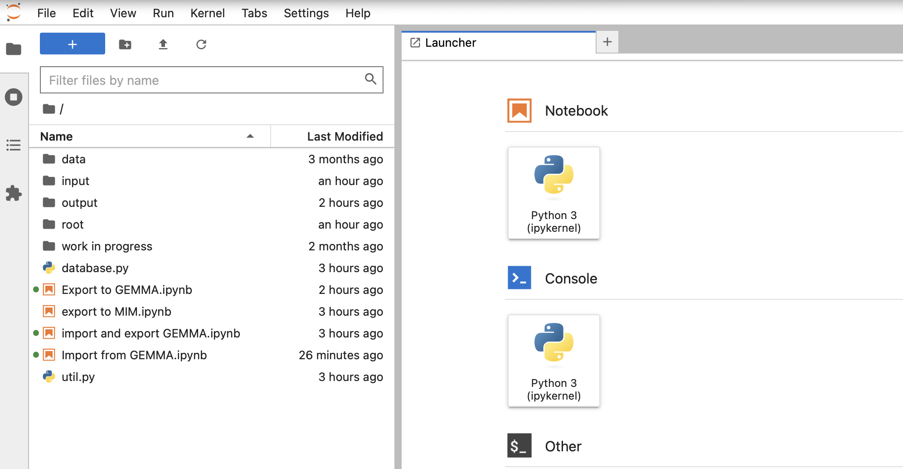

# Tooling for manipulating the Delft Municipal Data Model

This package contains tooling to manipulate the database of the Delft Municipal Data Model (Dutch: *Gemeentelijk Gegevensmodel*, abbreviated **GGM**). It can be used to design exchanges with third parties, to drive the migration to MIM, or to generate JSON-LD or database schemas. The tooling exploits the fact that the GGM is held in Sparx Enterprise Architect, where the GGM repository is maintained in [SQLite](https://www.sqlite.org/index.html). Data can be read from and manipulated in this SQLite database, and the database itself can be modified.

The tooling is based on [Jupyter Notebooks](https://jupyter.org) and [Python](https://www.python.org).

## Getting started

Make sure you have [Docker](https://www.docker.com) and [Docker Compose](https://github.com/docker/compose) installed. The project is built on top of the [Docker Jupyter Minimal Notebook](https://github.com/jupyter/docker-stacks). To work with the Jupyter notebooks you need to have downloaded the entire Municipal Information Model repository. The notebooks query the [EA 16 version](https://github.com/Gemeente-Delft/Gemeentelijk-Gegevensmodel/blob/master/v2.1.0/gemeentelijk%20gegevensmodel%20EA16.qea) of the GGM directly.

### Start the container

From the root of your GGM download, go to the `tools` subdirectory. Start the Jupyter container with `docker compose up`:

```sh
$ docker-compose up
```

### Access the notebooks

The Jupyter notebooks are now available at [http://localhost:8888/](http://localhost:8888/). The `input` and `output` directories under `tools` are mounted into the container and visible from the notebooks.



<em>Screenshot (in Dutch): Jupyter Lab showing the mounted "input" and "output" folders in the file browser.</em>

### Using the notebooks

The current toolset contains the following notebooks:

1. [Import from GEMMA](http://localhost:8888/lab/workspaces/auto-1/tree/Import%20from%20GEMMA.ipynb) — part of the entity exchange with GEMMA. Used to import exports from GEMMA.
2. [Export to GEMMA](http://localhost:8888/lab/workspaces/auto-1/tree/Export%20to%20GEMMA.ipynb) — part of the entity exchange with GEMMA. Used to produce exports that can be imported into GEMMA.
3. [Export to MIM](http://localhost:8888/lab/workspaces/auto-1/tree/Export%20to%20MIM.ipynb) — **work in progress.** For converting the GGM to MIM.
